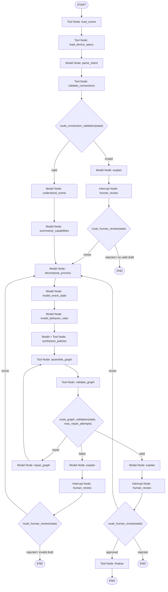
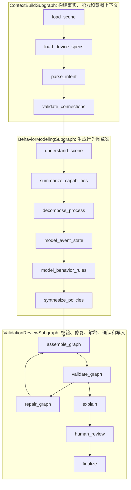

# SceneBehaviorGraph Agent Graph

本目录保存 `SceneBehaviorGraph` Agent 的 LangGraph 编排代码。当前 Agent 是一个**建模图**：它从 `SceneDocument + DeviceSpec + 用户目标` 生成 `SceneBehaviorGraph`，不承担 Runtime 高频调度。

## 1. 文件说明

| 文件 | 作用 |
|---|---|
| `builder.py` | 构建真实 LangGraph `StateGraph`，注册节点、普通边和条件边。 |
| `app.py` | LangGraph CLI / Studio 入口，导出编译后的 `graph`。 |
| `runner.py` | 本地 fallback runner；未安装 `langgraph` 时按同一节点顺序执行。 |

## 2. LangGraph 标准对象映射

| LangGraph 对象 | 当前实现 |
|---|---|
| `StateGraph` | `StateGraph(AgentState)`，以 `AgentState` 作为全图共享状态。 |
| `START` | 图入口，第一步进入 `load_scene`。 |
| `END` | 图结束，用户拒绝或最终写入完成后到达。 |
| Node | `load_scene`、`parse_intent`、`validate_graph` 等可观察执行单元。 |
| Edge | 固定顺序执行的普通边，例如 `load_scene -> load_device_specs`。 |
| Conditional Edge | 由 router 函数决定分支，例如连接校验、图校验、人工确认。 |
| Tool Node | 调用确定性工具读取、校验、组装、写入。 |
| Model Node | 调用模型或确定性 Planner 生成语义草案。 |
| Interrupt Node | `human_review`，生产环境可暂停等待用户确认。 |

## 3. 当前 AgentState 流转

```text
输入: scene_document_ref + user_goal_raw + output_path?

load_scene
  -> 写入 scene_id / scene_revision / scene_facts / device_spec_refs
load_device_specs
  -> 写入 device_capabilities
parse_intent
  -> 写入 intent
validate_connections
  -> 写入 connection_validation
understand_scene
  -> 写入 scene_facts.summary
summarize_capabilities
  -> 写入 device_capabilities.summary_text
decompose_process
  -> 写入 process_modules
model_event_state
  -> 写入 event_bus_draft / state_model_draft
model_behavior_rules
  -> 写入 behavior_rules_draft / state_transition_rules_draft / completion_conditions_draft
synthesize_policies
  -> 写入 policies_draft / failure_observations_draft
assemble_graph
  -> 写入 scene_behavior_graph_draft
validate_graph
  -> 写入 validation_report
repair_graph
  -> 写入修复后的草案字段 / repair_attempts
explain
  -> 写入 explanation
human_review
  -> 写入 approval_status
finalize
  -> 写入 final_scene_behavior_graph / output_path
```

## 4. 主运行图

下面的图按 `builder.py` 中真实 `StateGraph` 声明绘制，节点名称与代码保持一致。



## 5. 简化主链路图

如果只看成功路径，Agent 的运行链路如下：

```mermaid
flowchart LR
  START_NODE([START]) --> A[load_scene]
  A --> B[load_device_specs]
  B --> C[parse_intent]
  C --> D[validate_connections]
  D --> E[understand_scene]
  E --> F[summarize_capabilities]
  F --> G[decompose_process]
  G --> H[model_event_state]
  H --> I[model_behavior_rules]
  I --> J[synthesize_policies]
  J --> K[assemble_graph]
  K --> L[validate_graph]
  L --> M[explain]
  M --> N[human_review]
  N --> O[finalize]
  O --> END_NODE([END])
```



## 6. 子图拆分

按 LangGraph 工程实现，可以把主图理解成三个逻辑 subgraph。当前代码还没有显式拆成 `Subgraph` 类，但职责边界已经按这个结构组织。



## 7. 节点清单

| 节点 | LangGraph 类型 | 实现位置 | 主要工具 / 模型 | 主要写入状态 |
|---|---|---|---|---|
| `load_scene` | Tool Node | `nodes/context.py` | `SceneReader` | `scene_id`、`scene_revision`、`scene_facts`、`device_spec_refs` |
| `load_device_specs` | Tool Node | `nodes/context.py` | `DeviceSpecReader` | `device_capabilities` |
| `parse_intent` | Model Node | `nodes/context.py` | `PlannerModel.parse_intent()` | `intent` |
| `validate_connections` | Tool Node | `nodes/context.py` | `ConnectionValidator` | `connection_validation` |
| `understand_scene` | Model Node | `nodes/modeling.py` | `PlannerModel.summarize_scene()` | `scene_facts.summary` |
| `summarize_capabilities` | Model Node | `nodes/modeling.py` | `PlannerModel.summarize_capabilities()` | `device_capabilities.summary_text` |
| `decompose_process` | Model Node | `nodes/modeling.py` | `PlannerModel.decompose_process()` | `process_modules` |
| `model_event_state` | Model Node | `nodes/modeling.py` | `PlannerModel.model_event_state()` | `event_bus_draft`、`state_model_draft` |
| `model_behavior_rules` | Model Node | `nodes/modeling.py` | `PlannerModel.model_behavior_rules()` | `behavior_rules_draft`、`state_transition_rules_draft`、`completion_conditions_draft` |
| `synthesize_policies` | Model + Tool Node | `nodes/modeling.py` | `PolicyLibrary` | `policies_draft`、`failure_observations_draft` |
| `assemble_graph` | Tool Node | `nodes/validation.py` | `SceneBehaviorGraphWriter.assemble()` | `scene_behavior_graph_draft` |
| `validate_graph` | Tool Node | `nodes/validation.py` | `GraphValidator` | `validation_report` |
| `repair_graph` | Model Node | `nodes/validation.py` | `PlannerModel.repair()` | 修复后的草案字段、`repair_attempts` |
| `explain` | Model Node | `nodes/validation.py` | `ExplanationRenderer` / `PlannerModel.explain()` | `explanation` |
| `human_review` | Interrupt Node | `nodes/validation.py` | `AgentConfig.auto_approve` | `approval_status` |
| `finalize` | Tool Node | `nodes/validation.py` | `SceneBehaviorGraphWriter.write()` | `final_scene_behavior_graph`、`output_path` |

## 8. 条件边

| 条件边来源 | Router | 返回值 | 下一节点 | 含义 |
|---|---|---|---|---|
| `validate_connections` | `route_connection_validation` | `valid` | `understand_scene` | 显式连接可用于继续建模。 |
| `validate_connections` | `route_connection_validation` | `invalid` | `explain` | 连接存在错误，先解释并进入人工确认。 |
| `validate_graph` | `route_graph_validation` | `valid` | `explain` | 行为图草案通过校验，进入解释确认。 |
| `validate_graph` | `route_graph_validation` | `repair` | `repair_graph` | 行为图未通过，但仍在自动修复次数内。 |
| `validate_graph` | `route_graph_validation` | `failed` | `explain` | 行为图未通过且超过自动修复次数，交给用户确认。 |
| `human_review` | `route_human_review` | `approved` | `finalize` | 用户确认或本地配置自动通过，且存在已通过校验的行为图草案，写入最终行为图。 |
| `human_review` | `route_human_review` | `revise` | `decompose_process` | 用户要求修改，回到工艺模块拆解重新生成。 |
| `human_review` | `route_human_review` | `rejected` | `END` | 用户拒绝，或当前没有可 finalize 的有效行为图草案，本次 Agent run 结束。 |

## 9. Repair Loop

`validate_graph` 失败时不会无限自我反思，而是进入有界修复循环。

```text
validate_graph
  -> route_graph_validation
  -> repair_graph
  -> assemble_graph
  -> validate_graph
```

循环上限由 `AgentConfig.max_repair_attempts` 控制，当前默认值为 `2`。超过上限后，图进入 `explain -> human_review`，由用户或开发者判断是否修改目标、场景连接或设备规范。

## 10. Human Review / Interrupt

`human_review` 是 LangGraph 中的人工确认点。当前本地配置 `AgentConfig.auto_approve=True`，所以 demo 默认自动通过；生产环境可以将其改为真正的 interrupt：

```text
explain
  -> human_review(pause)
  -> 用户选择 approved / needs_revision / rejected
  -> route_human_review
```

人工确认时应展示：

| 展示项 | 说明 |
|---|---|
| `explanation` | Agent 对工艺运行机制的自然语言解释。 |
| `scene_behavior_graph_draft` | 结构化行为图草案。 |
| `validation_report` | 校验错误、警告和修复结果。 |
| `scene_id / scene_revision` | 本次建模绑定的场景版本。 |
| `device_spec_refs` | 本次建模引用的设备本体规范。 |

## 11. Runner 与真实 LangGraph 的关系

| 执行方式 | 文件 | 说明 |
|---|---|---|
| 真实 LangGraph | `builder.py` | 安装 `langgraph` 后构建并 `compile()` 成可执行图。 |
| CLI / Studio 入口 | `app.py` | 对外导出 `graph`，便于 LangGraph CLI 或 Studio 加载。 |
| 本地 fallback | `runner.py` | 未安装 `langgraph` 时，用 `SequentialSceneBehaviorAgent` 按同一节点和条件分支执行。 |

`runner.py` 不是新的业务架构，只是本地开发兜底。正式设计口径仍以 `StateGraph(AgentState)` 为准。

## 12. 与 Runtime 的边界

本图只生成 `final_scene_behavior_graph`。Runtime 消费该图并初始化 `RuntimeSnapshot` 后，才进入真实仿真循环：

```text
final_scene_behavior_graph + SceneDocument.materials
  -> Runtime 初始化 RuntimeSnapshot
  -> Scheduler 读取 SceneBehaviorGraph + RuntimeSnapshot
  -> SignalBusRuntime 投递 event_bus 事件
  -> ActionExecutor 执行动作
  -> SnapshotManager 更新 RuntimeSnapshot
```

因此，Agent 图是**行为建模图**，不是**运行时调度图**。
