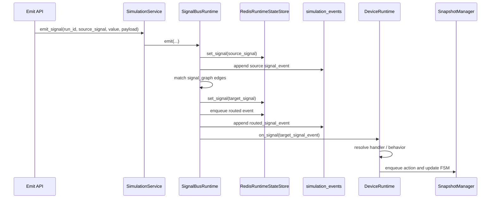

# SignalBusRuntime 设计归档

更新时间：2026-09-07  
阶段定位：下一阶段 Runtime 基础能力设计，不引入 Agent / LLM / 自动规划能力。

## 1. 结论

当前 `backend/` 已经完成了信号系统的**建模层**和**记录层**，但还没有完成真正的 `SignalBusRuntime` 消费者路由和回调触发。

一句话概括：

```text
现在能发 signal、保存 latest value、写事件日志；
还不能让 signal 自动沿 signal_edges 投递给消费者，并触发设备行为回调。
```

所以，后续要补的核心不是 CRUD，而是运行时信号链路：

```text
emit(source_signal)
  -> 匹配 signal_edges / event_bus.routes
  -> fan-out 到 target signal
  -> 写目标信号值 / 事件队列
  -> 触发 DeviceRuntime.on_signal(...)
  -> 分发到设备行为 handler
  -> 更新 RuntimeSnapshot
```

## 2. 当前已实现功能

### 2.1 静态信号建模

已实现内容：

- `DeviceSpec.signal_ports[]`：定义设备有哪些输入、输出、双向信号端口。
- `SceneDocument.signal_edges[]`：定义设备实例之间的信号连接事实。
- `TopologyGraph.signal_graph`：从 `SceneDocument.signal_edges[]` 派生信号传播图。
- `SignalEdgeCreate`：定义信号边创建 DTO，包括 `delivery`、`trigger`、`transform`、`timeout_ms`、`on_timeout`、`enabled`。
- `SceneService.create_edge(..., "signal")`：保存 signal edge，并校验 source/target 方向和值类型。
- `InterfaceCompiler`：可从 `process_edges + interface_bindings` 派生 `compiled_signal_edges`。

相关文件：

- `backend/app/schemas/domain.py`
- `backend/app/services/scene_service.py`
- `backend/app/services/interface_compiler.py`
- `backend/app/services/topology_builder.py`
- `docs/business/SimulationSchema/2.SceneDocument/schema.json`
- `docs/business/SimulationSchema/5.TopologyGraph/schema.json`

### 2.2 运行态信号记录

已实现内容：

- `POST /api/simulation-runs/{run_id}/signals/{signal_id}/emit`：对外暴露发信号入口。
- `SimulationService.emit_signal()`：校验 run 存在，调用 runtime store 写 signal，并记录 `simulation_events`。
- `RedisRuntimeStateStore.set_signal()`：
  - 用 Redis hash 保存最新信号值。
  - 用 Redis TTL 控制运行态过期。
  - 用 Redis stream 追加 `signal_event`。
- `RedisRuntimeStateStore.get_signals()`：读取当前 run 下的最新信号值。
- `RedisRuntimeStateStore.clear_run()`：清理 snapshot、signals、stream。

相关文件：

- `backend/app/api/simulation.py`
- `backend/app/services/simulation_service.py`
- `backend/app/services/runtime_state.py`
- `backend/app/db/models.py`

当前已实现链路：

```text
HTTP POST /signals/{signal_id}/emit
  -> SimulationService.emit_signal(run_id, signal_id, payload)
  -> RuntimeStateStore.set_signal(...)
  -> Redis hash: runtime:simulation:{run_id}:signals
  -> Redis stream: stream:simulation:{run_id}:events
  -> Supabase/Postgres table: simulation_events
```

## 3. 当前待完成功能

### 3.1 SignalBusRuntime 路由执行

待实现内容：

- 根据 `run_id` 找到 simulation run、scene、scene revision。
- 加载当前 scene document 和最新 topology graph。
- 读取 `signal_edges[]` 或 `TopologyGraph.signal_graph.edges[]`。
- 当 source signal 被 emit 时，找到所有启用的下游 target signal。
- 支持一对一、一对多 fan-out。
- 支持 `delivery`：`event`、`latest_value`、`command`、`broadcast`。
- 支持 `trigger`：`on_rising_edge`、`on_falling_edge`、`on_change`、`level`、`manual`。
- 支持 `transform`：至少先支持 `identity` 和简单 `payload_template`。
- 支持 `timeout_ms` / `on_timeout` 的最小记录机制。

### 3.2 消费者回调机制

待实现内容：

- 定义 `DeviceRuntime.on_signal(signal_event)`，对应 VC 的 `OnSignal(signal)`。
- 定义 `DeviceRuntime.on_signal_trigger(map, port, value)` 的抽象等价形式，支持未来 PLC I/O map。
- 定义 handler registry：按 `device_type + signal_id` 或 `behavior_id` 找到处理函数。
- 把 target signal 投递给消费者后，写入设备任务队列或状态机输入。

### 3.3 设备行为触发

待实现内容：

- 从 `DeviceSpec.transport_behaviors[]` / `runtime_contract` 中找到信号对应的行为。
- 根据输入信号触发设备行为，例如：
  - `robot.start_pick` -> `pick_and_place`
  - `conveyor.release_waiting_material` -> `release_material`
  - `conveyor.pause` -> 暂停传送
  - `conveyor.resume` -> 恢复传送
- 写入 `RuntimeSnapshot.active_actions[]` 或 `event_queue[]`。
- 后续由 `ActionExecutor` 执行动作，再由 `SnapshotManager` 更新状态。

### 3.4 RuntimeSnapshot 状态更新

待实现内容：

- 更新 `signal_values`：保存 source 和 target signal 的最新值。
- 更新 `event_queue`：保存待消费事件。
- 更新 `device_fsm_states`：例如 idle -> busy -> done。
- 更新 `active_actions`：记录被触发但尚未完成的动作。
- 更新 `wait_queues` / `resource_locks`：后续用于 backpressure、资源互斥、死锁检测。

## 4. VC 中的信号事件处理方案

VC 的信号事件处理不是一个集中式全局 SignalBus，而是分散在 signal、signal map、component behaviour 和 PythonScript 中。

### 4.1 基础信号对象

VC 中基础信号对象的典型职责：

| VC 对象 / 方法 | 含义 |
| --- | --- |
| `vcSignal.connect(signal, connect_in_gui)` | 连接另一个信号或可接收信号的对象 |
| `vcSignal.Connections` | 当前信号连接到的对象列表 |
| `vcSignal.OnValueChange` | 信号值变化事件 |
| `vcBoolSignal.Value` | 当前布尔值，只代表状态 |
| `vcBoolSignal.signal(value)` | 真正发出信号，广播给连接对象，并触发脚本回调 |
| `OnSignal(signal)` | PythonScript 接收信号后的统一回调入口 |

关键点：

```text
写 Value 只是改状态；
调用 signal(value) 才是一次事件投递。
```

### 4.2 SignalMap / PLC I/O 模式

VC 还支持类似 PLC I/O 板卡的 `vcBooleanSignalMap`：

| VC 对象 / 方法 | 含义 |
| --- | --- |
| `PortCount` / `Ports` | 定义 I/O 端口数量和范围 |
| `Direction` | 输入、输出、未定义 |
| `addPort(index, signal)` | 将某个端口绑定到 `vcBoolSignal` |
| `connect(indexPort1, signal)` | 端口连接到单个 signal |
| `connect(indexPort1, SignalMap2, indexPort2)` | signal map 端口对端口连接 |
| `input(index)` / `output(index, value)` | 读取输入或写输出 |
| `OnSignalTrigger(signal_map, port, value)` | 端口值变化后的回调 |

这说明 VC 的信号不是“设备 A 直接调用设备 B 的函数”，而是：

```text
设备 A 输出信号 / 输出端口
  -> VC 信号连接关系
  -> 设备 B 输入信号 / 输入端口
  -> 设备 B 的脚本回调
  -> 脚本内部 dispatch 到具体动作函数
```

### 4.3 Machine Wizard 模式

VC 的 Machine Wizard 会生成 PLC 风格信号，例如：

```text
FROM_PLC_StartProcess
FROM_PLC_OpenDoor
FROM_PLC_CloseDoor
TO_PLC_ProcessIsRunning
TO_PLC_DoorIsOpen
TO_PLC_DoorIsClosed
```

典型执行方式：

```python
def OnSignal(signal):
    if signal in triggerSignals:
        tasks.append([signal.Name, signal.Value])

def OnRun():
    while True:
        condition(lambda: tasks)
        signal_name, signal_val = tasks.pop(0)
        if signal_name == "FROM_PLC_StartProcess" and signal_val:
            machineProcess(processingTime)

def machineProcess(time, part=None):
    running.signal(True)
    delay(time)
    running.signal(False)
```

抽象成链路就是：

```text
外部/PLC 发 FROM_PLC_StartProcess=True
  -> signal.signal(True)
  -> PythonScript.OnSignal(signal)
  -> tasks.append(...)
  -> OnRun 消费任务
  -> machineProcess(...)
  -> TO_PLC_ProcessIsRunning.signal(True/False)
```

### 4.4 Robot Action Script 模式

VC 的机器人 Action Script 会读取机器人 `DigitalOutputSignals` / `DigitalInputSignals`，并把输出 signal map 的 `OnSignalTrigger` 绑定到处理函数。

典型链路：

```text
Robot digital output port changed
  -> outputmap.OnSignalTrigger(map, port, value)
  -> OutputTriggered(map, port, value)
  -> 查 action table
  -> 调用 Grasp / Release / MountTool / UnmountTool / TraceOn 等动作
```

这证明 VC 中很多“动作编排”本质是信号驱动的局部脚本分发，而不是全局流程直接调用每台设备的函数。

## 5. 我们这边的实现方案

### 5.1 总体策略

我们不照搬 VC 的脚本式 `OnSignal`，而是实现一个服务端可测试、可持久化、可回放的 `SignalBusRuntime`。

设计原则：

- `SceneDocument.signal_edges[]` 保存静态连接事实。
- `TopologyGraph.signal_graph` 是运行时查询索引。
- `SignalBusRuntime` 执行信号投递，不保存长期业务事实。
- Redis 保存高频运行态和事件队列。
- Supabase/Postgres 保存低频业务事实和事件审计。
- 设备行为不要硬编码在 signal edge 上，而是由 `DeviceRuntime` 根据 `DeviceSpec` 分发。
- 当前阶段不引入 Agent，不做 LLM 规划，不自动生成复杂行为图。

### 5.2 建议新增文件

建议下一阶段新增以下文件：

```text
backend/app/services/signal_bus_runtime.py
backend/app/services/device_runtime.py
backend/app/services/runtime_handlers.py
backend/app/services/snapshot_manager.py
backend/app/schemas/runtime.py
backend/tests/test_signal_bus_runtime.py
```

职责划分：

| 文件 | 职责 |
| --- | --- |
| `signal_bus_runtime.py` | emit、路由匹配、trigger 判断、payload transform、fan-out、写 target events |
| `device_runtime.py` | 类似 VC `OnSignal` 的设备级入口，根据设备类型和 signal 分发行为 |
| `runtime_handlers.py` | conveyor、robot、lift_table、storage_rack 等设备类型的最小 handler |
| `snapshot_manager.py` | 统一修改 RuntimeSnapshot 的 `signal_values/event_queue/device_fsm_states/active_actions` |
| `schemas/runtime.py` | `SignalEvent`、`RoutedSignalEvent`、`DeviceTask`、`RuntimeDispatchResult` 等 DTO |

### 5.3 数据结构建议

建议新增运行时事件结构：

```json
{
  "event_id": "evt_xxx",
  "run_id": "simrun_xxx",
  "source_signal": "main_conveyor_1.part_ready",
  "target_signal": "robot_1.start_pick",
  "value": true,
  "payload": {
    "material_id": "part_001"
  },
  "route_id": "route_sig_main_to_robot",
  "delivery": "event",
  "trigger": "on_rising_edge",
  "status": "queued",
  "created_at_sim_time_s": 1.5
}
```

建议新增设备任务结构：

```json
{
  "task_id": "task_xxx",
  "run_id": "simrun_xxx",
  "instance_id": "robot_1",
  "device_type": "robot_arm",
  "trigger_signal": "robot_1.start_pick",
  "behavior_id": "pick_and_place",
  "payload": {
    "material_id": "part_001",
    "source": "main_conveyor_1.exit",
    "target": "upper_outfeed_1.entry"
  },
  "status": "pending"
}
```

建议 Redis key：

```text
runtime:simulation:{run_id}:snapshot              # 当前 RuntimeSnapshot
runtime:simulation:{run_id}:signals               # hash，latest signal values
runtime:simulation:{run_id}:event_queue           # list/stream，待消费事件
runtime:simulation:{run_id}:device_tasks          # stream/list，设备待执行任务
stream:simulation:{run_id}:events                 # stream，完整事件流水
```

## 6. 我们的信号处理链路

### 6.1 第一阶段：source signal emit

```text
POST /api/simulation-runs/{run_id}/signals/{source_signal}/emit
  -> SimulationService.emit_signal(...)
  -> SignalBusRuntime.emit(...)
  -> RuntimeStateStore.set_signal(source_signal, value, payload)
  -> simulation_events 写 source signal_event
```

这一步对应 VC：

```text
vcBoolSignal.signal(value)
```

### 6.2 第二阶段：路由匹配

```text
SignalBusRuntime.load_context(run_id)
  -> 读取 SimulationRun
  -> 读取 SceneDocument
  -> 读取最新 TopologyGraph
  -> 构建 signal_graph index

SignalBusRuntime.match_routes(source_signal)
  -> 找 signal_graph.edges where edge.source == source_signal
  -> 过滤 enabled=false
  -> 判断 trigger
  -> 应用 transform
```

这一步对应 VC：

```text
vcSignal.Connections
vcBooleanSignalMap.getConnectedExternalSignals(index)
vcBooleanSignalMap.getConnectedExternalPorts(index)
```

### 6.3 第三阶段：target signal fan-out

```text
for each matched route:
  target_signal = route.target
  RuntimeStateStore.set_signal(target_signal, transformed_value, transformed_payload)
  RuntimeStateStore.enqueue_event(target_signal_event)
  simulation_events 写 routed_signal_event
```

这一步对应 VC：

```text
signal.signal(value) 广播给所有 Connections
```

### 6.4 第四阶段：消费者回调

```text
SignalBusRuntime.dispatch(target_signal_event)
  -> DeviceRuntime.on_signal(target_signal_event)
  -> resolve instance_id + signal_port
  -> resolve DeviceSpec.runtime_contract / transport_behaviors
  -> runtime_handlers.dispatch(device_type, signal_port, event)
```

这一步对应 VC：

```text
PythonScript.OnSignal(signal)
vcBooleanSignalMap.OnSignalTrigger(map, port, value)
```

### 6.5 第五阶段：行为任务生成

```text
DeviceRuntime.on_signal(robot_1.start_pick)
  -> 找到 robot_arm_1 transport_behaviors.pick_and_place
  -> 检查设备 FSM / resource lock / capacity
  -> enqueue DeviceTask(pick_and_place)
  -> RuntimeSnapshot.device_fsm_states.robot_1 = queued/busy
  -> RuntimeSnapshot.active_actions += action
```

这一步对应 VC：

```text
OnSignal -> tasks.append(...)
OnRun -> condition(lambda: tasks) -> 执行动作函数
```

### 6.6 第六阶段：动作完成后继续发信号

```text
ActionExecutor completes pick_and_place
  -> SnapshotManager 更新 material_locations / active_actions / fsm
  -> SignalBusRuntime.emit(robot_1.done, payload)
  -> 下游 conveyor.release_waiting_material 被触发
```

这一步对应 VC：

```text
machineProcess(...)
  -> running.signal(True)
  -> delay(time)
  -> running.signal(False)
```

## 7. 端到端示例

以传送带触发机械臂抓取为例：

```text
1. main_conveyor_1 物料到达出口
2. Runtime 调用 emit(main_conveyor_1.part_ready, true, { material_id })
3. SignalBusRuntime 查 signal_edges：
   main_conveyor_1.part_ready -> robot_1.start_pick
4. Runtime 写入 robot_1.start_pick latest value 和 routed event
5. DeviceRuntime.on_signal(robot_1.start_pick)
6. Robot handler 解析 start_pick -> pick_and_place
7. SnapshotManager 写入 active_actions / device_fsm_states
8. ActionExecutor 执行 pick_and_place
9. 动作完成后 emit(robot_1.done, true, { material_id })
10. SignalBusRuntime 继续路由到下游 conveyor.release_waiting_material
```

对应 Mermaid：



## 8. 与 VC 的差异

| 维度 | VC | 当前项目建议 |
| --- | --- | --- |
| 信号连接 | `vcSignal.Connections` / `vcBooleanSignalMap.connect()` | `SceneDocument.signal_edges[]` + `TopologyGraph.signal_graph` |
| 发信号 | `vcBoolSignal.signal(value)` | `SignalBusRuntime.emit(...)` |
| 最新值 | `vcBoolSignal.Value` | Redis hash `runtime:simulation:{run_id}:signals` + `RuntimeSnapshot.signal_values` |
| 消费者回调 | `OnSignal(signal)` / `OnSignalTrigger(map, port, value)` | `DeviceRuntime.on_signal(event)` / handler registry |
| 任务队列 | PythonScript 内部 `tasks[]` | Redis event queue / device task queue + RuntimeSnapshot.active_actions |
| 事件审计 | 主要在 VC runtime/script 内部，外部不易统一追踪 | `simulation_events` 表 + Redis stream |
| 可测试性 | 依赖 VC runtime 和脚本环境 | 后端 service 单测 + Redis/Supabase 集成测试 |

## 9. 最小可落地版本

下一阶段可以先实现一个轻量版本，不碰复杂调度：

1. 新增 `SignalBusRuntime.emit()`，替代 `SimulationService.emit_signal()` 里直接调用 `runtime_store.set_signal()`。
2. `SignalBusRuntime` 只读取 `SceneDocument.signal_edges[]`，暂不依赖完整 `SceneBehaviorGraph.event_bus`。
3. 支持 source -> target fan-out，先实现 `identity` transform。
4. 对每个 target signal 写 Redis latest value 和 Redis stream。
5. 新增 `DeviceRuntime.on_signal()`，先只生成 `device_tasks`，不执行真实动作。
6. `SimulationService.emit_signal()` 返回 source event、routed events、device tasks。
7. 补充 `test_signal_bus_runtime.py`，覆盖：
   - 单个 signal 无消费者。
   - 单个 signal 投递到一个消费者。
   - 单个 signal fan-out 到多个消费者。
   - disabled edge 不投递。
   - identity transform 保留 value/payload。
   - target signal 被写入 Redis。
   - device task 被生成但不执行。

最小链路：

```text
emit source signal
  -> source latest value
  -> match SceneDocument.signal_edges
  -> write target latest value
  -> append routed event
  -> create device task
```

## 10. 后续增强版本

在最小版本稳定后，再逐步补：

- 从 `TopologyGraph.signal_graph` 而不是原始 scene edges 读取路由。
- 支持 `SceneBehaviorGraph.event_bus.routes/topics/subscriptions`。
- 支持 `payload_template`、字段映射和条件过滤。
- 支持 `on_rising_edge` / `on_falling_edge` / `on_change` 的前值比较。
- 支持 timeout wheel 或延迟队列。
- 支持设备 FSM、resource locks、capacity guard。
- 接入 `ActionExecutor`，让 device task 真正推进 RuntimeSnapshot。
- 支持 WebSocket/SSE 把 routed events 推给前端。

## 11. 当前明确不做

为了保持当前阶段边界清晰，以下能力暂不纳入本阶段：

- 不引入 Agent。
- 不引入 LLM 调用。
- 不自动生成 SceneBehaviorGraph。
- 不做复杂全局调度器。
- 不做真实运动学、碰撞检测或连续时间仿真。
- 不直接执行 arbitrary Python callback，避免安全风险。
- 不把 signal edge 直接绑定到任意函数名；应通过受控 handler registry 分发。
