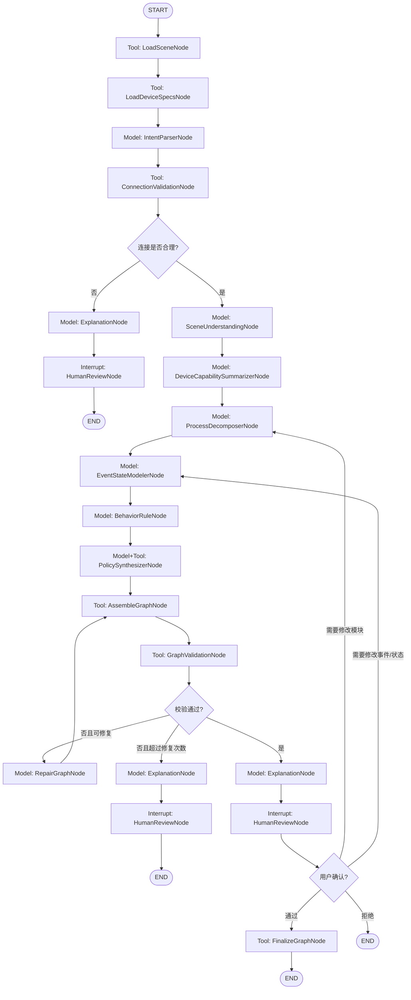

# SceneBehaviorGraph Agent LangGraph 设计方案

> 版本：v0.3
> 日期：2026-08-31
> 范围：仅描述 Agent 如何基于 LangGraph 生成 `SceneBehaviorGraph`。
> 边界：Runtime 调度器、SimPy/DES 执行、资源调度算法不属于本文主体，只作为 Agent 输出的下游消费者说明。

---

## 0. 设计定位

当前系统采用“离线 Agent 建模 + 在线 Runtime 调度”的双层架构：

```text
DeviceSpec + SceneDocument + 用户目标
  -> LangGraph Agent
  -> SceneBehaviorGraph

SceneBehaviorGraph + RuntimeSnapshot
  -> Runtime Scheduler
  -> 事件投递、规则匹配、资源仲裁、行为执行、状态更新
```

本文只定义第一段：**LangGraph Agent 如何生成 `SceneBehaviorGraph`**。

`SceneBehaviorGraph` 是 Agent 的最终产物，Runtime 运行时不依赖 Agent 高频参与。Agent 负责建模、解释和校验；Scheduler 负责执行。

---

## 1. LangGraph 基础概念映射

LangGraph 中的基础图可以抽象为：

| LangGraph 概念 | 在本方案中的含义 |
|---|---|
| `State` | Agent 运行过程中的共享状态对象，保存用户目标、场景摘要、设备能力索引、中间草案、校验结果、解释文本等。 |
| `Model Node` | 调用 LLM 的推理节点，用于意图解析、场景理解、模块分解、事件/规则/策略生成、解释生成等。 |
| `Tool Node` | 执行确定性工具调用的节点，用于读取 `SceneDocument`、读取 `DeviceSpec`、校验图结构、写入结果等。 |
| `Conditional Edge` | 根据当前 `State` 决定下一步流向，例如是否需要修复、是否需要用户确认、是否可以结束。 |
| `Interrupt` | 在关键阶段暂停，把 Agent 对场景调度的理解展示给用户确认。 |
| `Checkpoint` | 持久化 LangGraph 每一步状态，支持失败恢复、人工审查、回放和 time travel。 |
| `Store / Memory` | 存储跨 run 可复用的建模模板和经验，例如分拣线、共享工件池、backpressure 模式。 |
| `Subgraph` | 将复杂阶段封装成子图，例如“场景理解子图”“行为图生成子图”“校验修复子图”。 |
| `Streaming` | 流式输出 Agent 当前理解、生成进度、校验错误和解释摘要。 |

因此，原方案中的“节点总览”不是 `State`，也不是简单模块列表，而是 **LangGraph 的 node 列表**：其中一部分是 LLM Model Node，一部分是 Tool Node，一部分是控制节点或人工确认节点。它们共同读写同一个 `AgentState`。

---

## 2. AgentState 设计

`AgentState` 是 LangGraph 图中所有节点共享和更新的状态对象。建议使用 TypedDict / Pydantic schema 约束字段。

### 2.1 核心字段

| 字段 | 类型 | 说明 |
|---|---|---|
| `run_id` | string | 本次 Agent 生成任务 ID。 |
| `scene_id` | string | 当前场景 ID。 |
| `scene_revision` | string | 当前场景版本，避免场景更新后误用旧图。 |
| `user_goal_raw` | string | 用户原始自然语言目标。 |
| `intent` | object | 结构化意图，包括目标、约束、阶段、指标、假设。 |
| `scene_document_ref` | string | `SceneDocument` 引用路径或数据库 ID。 |
| `scene_facts` | object | 从 `SceneDocument` 抽取的场景事实摘要。 |
| `device_spec_refs` | array | 本场景涉及的 `DeviceSpec` 引用列表。 |
| `device_capabilities` | object | 设备能力索引，包括接口、行为、信号口、资源、容量。 |
| `connection_validation` | object | 显式连接合理性校验结果。 |
| `process_modules` | array | 业务模块草案，例如托盘运输、并行分拣、出料传送。 |
| `event_bus_draft` | object | `SceneBehaviorGraph.event_bus` 草案。 |
| `state_model_draft` | object | `SceneBehaviorGraph.state_model` 草案。 |
| `behavior_rules_draft` | array | `behavior_rules` 草案。 |
| `state_transition_rules_draft` | array | `state_transition_rules` 草案。 |
| `policies_draft` | object | `policies` 草案。 |
| `completion_conditions_draft` | array | 完成条件草案。 |
| `failure_observations_draft` | array | 异常观测草案。 |
| `scene_behavior_graph_draft` | object | 汇总后的完整行为图草案。 |
| `validation_report` | object | 结构校验和引用校验结果。 |
| `repair_attempts` | integer | 自动修复次数。 |
| `explanation` | string | 面向用户的场景调度理解说明。 |
| `approval_status` | enum | `pending`、`approved`、`rejected`、`needs_revision`。 |
| `final_scene_behavior_graph` | object | 用户确认且校验通过后的最终产物。 |
| `messages` | array | LangGraph 消息历史，用于模型节点上下文。 |

### 2.2 状态写入原则

- LLM 节点只写入语义草案和解释结果，不直接写最终产物。
- Tool 节点负责读取外部事实、执行确定性校验、写入持久化结果。
- 每个节点只更新自己负责的字段，避免一个节点覆盖整份 `AgentState`。
- `final_scene_behavior_graph` 只能由 `FinalizeGraphNode` 在校验通过且用户确认后写入。

---

## 3. 节点类型总览

原方案中的节点应重新归类为 LangGraph node，而不是状态字段。

| 节点 | LangGraph 类型 | 是否调用模型 | 是否调用工具 | 主要写入状态 |
|---|---|---:|---:|---|
| `LoadSceneNode` | Tool Node | 否 | 是 | `scene_facts`、`device_spec_refs` |
| `LoadDeviceSpecsNode` | Tool Node | 否 | 是 | `device_capabilities` |
| `IntentParserNode` | Model Node | 是 | 否 | `intent` |
| `ConnectionValidationNode` | Tool Node + optional Model Node | 可选 | 是 | `connection_validation` |
| `SceneUnderstandingNode` | Model Node | 是 | 可选 | `scene_facts.summary`、候选模块线索 |
| `DeviceCapabilitySummarizerNode` | Model Node | 是 | 否 | `device_capabilities.summary` |
| `ProcessDecomposerNode` | Model Node | 是 | 否 | `process_modules` |
| `EventStateModelerNode` | Model Node | 是 | 否 | `event_bus_draft`、`state_model_draft` |
| `BehaviorRuleNode` | Model Node | 是 | 否 | `behavior_rules_draft`、`state_transition_rules_draft` |
| `PolicySynthesizerNode` | Model Node + Tool Node | 是 | 是 | `policies_draft`、`failure_observations_draft` |
| `AssembleGraphNode` | Tool Node | 否 | 是 | `scene_behavior_graph_draft` |
| `GraphValidationNode` | Tool Node | 否 | 是 | `validation_report` |
| `RepairGraphNode` | Model Node | 是 | 否 | 修订后的草案字段 |
| `ExplanationNode` | Model Node | 是 | 否 | `explanation` |
| `HumanReviewNode` | Interrupt / Human-in-the-loop | 否 | 否 | `approval_status` |
| `FinalizeGraphNode` | Tool Node | 否 | 是 | `final_scene_behavior_graph` |

---

## 4. 节点详细设计

### 4.1 `LoadSceneNode`

- **类型**：Tool Node
- **输入状态**：`scene_document_ref`
- **调用工具**：`SceneReader`
- **输出状态**：`scene_facts`、`device_spec_refs`
- **职责**：读取 `SceneDocument`，抽取设备实例、物料、显式连接、场景边、信号边、位姿和拓扑信息。

### 4.2 `LoadDeviceSpecsNode`

- **类型**：Tool Node
- **输入状态**：`device_spec_refs`
- **调用工具**：`DeviceSpecReader`
- **输出状态**：`device_capabilities`
- **职责**：读取相关 `DeviceSpec`，建立行为、接口、信号口、资源、容量约束索引。

### 4.3 `IntentParserNode`

- **类型**：Model Node
- **输入状态**：`user_goal_raw`
- **输出状态**：`intent`
- **职责**：将用户自然语言目标解析为结构化工艺意图。

输出示例：

```json
{
  "goal": "托盘运输到位后由两台机械臂持续分拣物料",
  "constraints": ["只使用显式连接", "不做中途重规划"],
  "assumptions": ["两个机械臂共享托盘工件池", "出料传送带满载后需要 backpressure"],
  "success_criteria": ["所有物料完成分拣", "无 active actions", "出料传送带清空"]
}
```

### 4.4 `ConnectionValidationNode`

- **类型**：Tool Node，必要时可调用 Model Node 生成解释建议
- **输入状态**：`scene_facts`、`device_capabilities`
- **调用工具**：`ConnectionValidator`、`GraphValidator`
- **输出状态**：`connection_validation`
- **职责**：校验显式连接是否合理，包括设备接口类型是否匹配、流程边是否可达、信号边是否引用存在的信号口。

如果连接不合理，图应进入 `ExplanationNode` 或错误结束，不继续生成最终行为图。

### 4.5 `SceneUnderstandingNode`

- **类型**：Model Node
- **输入状态**：`scene_facts`、`intent`
- **输出状态**：`scene_facts.summary`
- **职责**：生成自然语言场景理解摘要，为后续模块分解提供上下文；识别所有 conveyor 都需要按停留点 / 占位点进行运输建模。

### 4.6 `DeviceCapabilitySummarizerNode`

- **类型**：Model Node
- **输入状态**：`device_capabilities`
- **输出状态**：`device_capabilities.summary`
- **职责**：把设备能力索引转成适合 LLM 推理的摘要，例如每类设备可执行行为、信号、资源约束；对 conveyor 额外提取 `stop_point_model`、默认停留点数量、容量和恢复阈值。

### 4.7 `ProcessDecomposerNode`

- **类型**：Model Node
- **输入状态**：`intent`、`scene_facts.summary`、`device_capabilities.summary`
- **输出状态**：`process_modules`
- **职责**：将用户目标拆成业务模块，标注模块模式：`one_shot`、`sequential`、`parallel_continuous`、`continuous`；传送带运输模块应优先标注为 `stop_point_buffered_transport`。

### 4.8 `EventStateModelerNode`

- **类型**：Model Node
- **输入状态**：`process_modules`、`device_capabilities`、`scene_facts`
- **输出状态**：`event_bus_draft`、`state_model_draft`
- **职责**：生成本场景需要注册的事件、topic、subscriptions、routes、状态变量和 payload schema；包含 conveyor 场景时必须生成 `conveyor_stop_points`、`conveyor_occupancy`、`conveyor_queues`、`conveyor_loads`。

### 4.9 `BehaviorRuleNode`

- **类型**：Model Node
- **输入状态**：`event_bus_draft`、`state_model_draft`、`device_capabilities`、`process_modules`
- **输出状态**：`behavior_rules_draft`、`state_transition_rules_draft`
- **职责**：定义事件如何触发设备行为，以及行为开始、完成、异常后如何更新状态和发出事件；传送带规则必须覆盖停留点接收、逐点推进、等待、释放、阻塞和恢复。

### 4.10 `PolicySynthesizerNode`

- **类型**：Model Node + Tool Node
- **输入状态**：`behavior_rules_draft`、`state_model_draft`、`process_modules`
- **调用工具**：`PolicyLibrary`
- **输出状态**：`policies_draft`、`failure_observations_draft`
- **职责**：从策略库选择并参数化策略，例如共享工件池、backpressure、资源锁、deadlock detection；传送带默认启用 `queue_wait`、`capacity_threshold`、`nearest_available_stop_point` 和 `downstream_release`。

### 4.11 `AssembleGraphNode`

- **类型**：Tool Node
- **输入状态**：各类 draft 字段
- **调用工具**：`SceneBehaviorGraphWriter`
- **输出状态**：`scene_behavior_graph_draft`
- **职责**：把分散草案组装成完整 `SceneBehaviorGraph`。

### 4.12 `GraphValidationNode`

- **类型**：Tool Node
- **输入状态**：`scene_behavior_graph_draft`、`scene_facts`、`device_capabilities`
- **调用工具**：`GraphValidator`
- **输出状态**：`validation_report`
- **职责**：执行确定性校验。

校验项包括：

- 所有 `instance_id` 存在于 `SceneDocument.instances`。
- 所有 `behavior_id` 存在于对应 `DeviceSpec.transport_behaviors` 或行为能力集合。
- 所有 `event_bus.routes[].from` 存在于 `event_bus.events`。
- 所有 `topic` 都有对应 `subscriptions`。
- 所有 `behavior_rules.trigger.event_id` 存在于事件注册或 topic 展开后的 `message_event_id`。
- 所有 `guard / policy / action` 引用的状态变量存在于 `state_model`。
- 所有 `state_transition_rules.effects` 只更新已声明状态或 emit 已注册事件。
- conveyor 场景必须声明停留点状态、占用状态、等待队列、容量状态，以及对应 `queue_wait` / `capacity_threshold` / `nearest_available_stop_point` / `downstream_release` 策略。

### 4.13 `RepairGraphNode`

- **类型**：Model Node
- **输入状态**：`scene_behavior_graph_draft`、`validation_report`
- **输出状态**：修订后的草案字段、`repair_attempts`
- **职责**：根据校验报告修复草案。最多自动修复 2～3 次，超过阈值后交给用户或开发者审查。

### 4.14 `ExplanationNode`

- **类型**：Model Node
- **输入状态**：校验通过的 `scene_behavior_graph_draft`
- **输出状态**：`explanation`
- **职责**：向用户展示 Agent 对场景调度的理解，包括模块划分、事件流、状态变量、策略、异常处理和完成条件。

### 4.15 `HumanReviewNode`

- **类型**：Interrupt / Human-in-the-loop
- **输入状态**：`explanation`、`scene_behavior_graph_draft`
- **输出状态**：`approval_status`
- **职责**：暂停图执行，等待用户确认、修改或拒绝。

第一阶段可以把该节点配置为可选：本地 demo 默认自动通过；生产或论文实验启用人工确认。

### 4.16 `FinalizeGraphNode`

- **类型**：Tool Node
- **输入状态**：`approval_status`、`scene_behavior_graph_draft`
- **调用工具**：`SceneBehaviorGraphWriter`
- **输出状态**：`final_scene_behavior_graph`
- **职责**：持久化最终 `SceneBehaviorGraph`，绑定 `scene_id`、`scene_revision`、`device_spec_versions` 和 `agent_run_id`。

---

## 5. 工具设计

### 5.1 工具清单

| 工具 | 所属节点 | 输入 | 输出 | 说明 |
|---|---|---|---|---|
| `SceneReader` | `LoadSceneNode` | `scene_document_ref` | `scene_facts`、`device_spec_refs` | 读取场景实例、物料、显式连接、信号边和物理边。 |
| `DeviceSpecReader` | `LoadDeviceSpecsNode` | `device_spec_refs` | `device_capabilities` | 读取设备接口、信号口、行为能力、资源和容量约束。 |
| `ConnectionValidator` | `ConnectionValidationNode` | `scene_facts`、`device_capabilities` | `connection_validation` | 校验显式连接是否合理。 |
| `PolicyLibrary` | `PolicySynthesizerNode` | 策略名称、场景参数 | 策略定义草案 | 提供 shared-pool-claim、backpressure、resource-lock、deadlock-detection 等模板。 |
| `GraphValidator` | `GraphValidationNode` | `scene_behavior_graph_draft`、上游事实 | `validation_report` | 校验引用完整性、状态完整性、路由闭环和策略可判定性。 |
| `SceneBehaviorGraphWriter` | `AssembleGraphNode`、`FinalizeGraphNode` | drafts 或最终图 | `SceneBehaviorGraph` | 组装和持久化行为图。 |
| `ExplanationRenderer` | `ExplanationNode` | `scene_behavior_graph_draft` | `explanation` | 将行为图渲染为用户可读解释。 |
| `MemoryStore` | 可选 | 模板查询条件 | 可复用模式 | 查询长期记忆中的建模模板。 |

### 5.2 工具边界

- 工具必须是确定性或可审计的，不能在工具内部隐式生成行为图。
- LLM 负责语义推理和草案生成，工具负责读取事实、校验事实和写入结果。
- `PolicyLibrary` 输出的是策略模板和参数，不直接替代 Runtime 调度器。
- `GraphValidator` 是最终行为图入库前的强制门禁。

---

## 6. Capabilities 设计

结合 LangGraph 官方能力，本 Agent 建议使用以下能力。

### 6.1 Persistence

用于持久化 Agent run、输入引用、最终 `SceneBehaviorGraph`、校验报告和用户确认记录。

建议持久化内容：

- `agent_run_id`
- `scene_id`
- `scene_revision`
- `device_spec_versions`
- `final_scene_behavior_graph`
- `validation_report`
- `approval_status`
- `created_at / updated_at`

### 6.2 Checkpointers

用于保存 LangGraph 每个节点执行后的 `AgentState`。

用途：

- 节点失败后从最近 checkpoint 恢复。
- 对比修复前后的草案差异。
- 支持论文实验中的推理过程复现。
- 支持 time travel 调试。

### 6.3 Stores

用于保存跨 run 可复用知识，和单次 run checkpoint 分开。

可存内容：

- 分拣线模板。
- 出料 backpressure 模板。
- 共享工件池 claim 模板。
- 资源锁模板。
- 常见设备协作模式。
- 用户偏好的解释格式或建模约定。

### 6.4 Fault tolerance

用于处理节点失败、工具失败、校验失败和模型输出不合法。

策略：

- 工具读取失败：返回可解释错误，不进入生成阶段。
- 校验失败：进入 `RepairGraphNode`。
- 修复超过次数：中断并请求人工处理。
- 用户拒绝：回到对应生成节点，而不是直接覆盖最终结果。

### 6.5 Event streaming

用于把 Agent 内部阶段事件输出给前端或日志系统。

示例事件：

- `agent.scene_loaded`
- `agent.device_specs_loaded`
- `agent.intent_parsed`
- `agent.graph_draft_created`
- `agent.validation_failed`
- `agent.validation_passed`
- `agent.waiting_for_user_review`
- `agent.finalized`

### 6.6 Streaming

用于流式展示模型节点的进度和解释内容。

适用阶段：

- 场景理解摘要生成。
- 模块分解结果生成。
- 用户确认说明生成。
- 校验错误解释。

### 6.7 Interrupts

用于用户确认点。

建议中断点：

1. 连接校验失败时，展示原因和建议。
2. 行为图生成后、最终入库前，展示 Agent 的调度理解。
3. 用户要求修改假设时，回到对应节点重新生成。

### 6.8 Time travel

用于调试和实验复现。

典型用途：

- 回到 `EventStateModelerNode` 前，尝试不同事件建模。
- 回到 `PolicySynthesizerNode` 前，比较不同策略组合。
- 回到 `RepairGraphNode` 前，检查校验失败来源。

### 6.9 Memory

长期记忆不参与 Runtime 高频调度，只用于 Agent 生成阶段。

记忆内容应是“建模经验”和“模板”，而不是某次运行中的实时状态。

### 6.10 Subgraphs

建议把主图拆成三个子图：

| 子图 | 包含节点 | 作用 |
|---|---|---|
| `ContextBuildSubgraph` | `LoadSceneNode`、`LoadDeviceSpecsNode`、`IntentParserNode`、`ConnectionValidationNode` | 构建事实、能力和意图上下文。 |
| `BehaviorModelingSubgraph` | `SceneUnderstandingNode`、`DeviceCapabilitySummarizerNode`、`ProcessDecomposerNode`、`EventStateModelerNode`、`BehaviorRuleNode`、`PolicySynthesizerNode` | 生成行为图各部分草案。 |
| `ValidationReviewSubgraph` | `AssembleGraphNode`、`GraphValidationNode`、`RepairGraphNode`、`ExplanationNode`、`HumanReviewNode`、`FinalizeGraphNode` | 校验、修复、解释、确认和最终写入。 |

---

## 7. 最终 LangGraph 图

### 7.1 主流程

```text
START
  -> LoadSceneNode
  -> LoadDeviceSpecsNode
  -> IntentParserNode
  -> ConnectionValidationNode
  -> route_connection_validation

route_connection_validation:
  if connection invalid -> ExplanationNode -> HumanReviewNode -> END or LoadSceneNode
  if connection valid -> SceneUnderstandingNode

SceneUnderstandingNode
  -> DeviceCapabilitySummarizerNode
  -> ProcessDecomposerNode
  -> EventStateModelerNode
  -> BehaviorRuleNode
  -> PolicySynthesizerNode
  -> AssembleGraphNode
  -> GraphValidationNode
  -> route_graph_validation

route_graph_validation:
  if validation passed -> ExplanationNode
  if validation failed and repair_attempts < max -> RepairGraphNode -> AssembleGraphNode
  if validation failed and repair_attempts >= max -> ExplanationNode -> HumanReviewNode

ExplanationNode
  -> HumanReviewNode
  -> route_human_review

route_human_review:
  if approved -> FinalizeGraphNode -> END
  if needs_revision -> ProcessDecomposerNode or EventStateModelerNode
  if rejected -> END
```

### 7.2 Mermaid 图



### 7.3 子图拆分

```text
ContextBuildSubgraph
  START -> LoadSceneNode -> LoadDeviceSpecsNode -> IntentParserNode -> ConnectionValidationNode

BehaviorModelingSubgraph
  SceneUnderstandingNode -> DeviceCapabilitySummarizerNode -> ProcessDecomposerNode -> EventStateModelerNode -> BehaviorRuleNode -> PolicySynthesizerNode

ValidationReviewSubgraph
  AssembleGraphNode -> GraphValidationNode -> RepairGraphNode? -> ExplanationNode -> HumanReviewNode -> FinalizeGraphNode
```

---

## 8. 输出产物

Agent 最终输出：

```text
final_scene_behavior_graph: SceneBehaviorGraph
```

同时产出审计材料：

- `agent_run_id`
- `AgentState` checkpoints
- `connection_validation`
- `validation_report`
- `explanation`
- `approval_status`
- `scene_id / scene_revision / device_spec_versions`

Runtime 只消费 `final_scene_behavior_graph` 和初始化后的 `RuntimeSnapshot`，不消费 LangGraph 中间节点状态。

---

## 9. 与 Runtime 调度器的边界

Agent 不负责运行时高频调度。

| 问题 | Agent 负责 | Runtime Scheduler 负责 |
|---|---|---|
| 场景应该如何运行 | 生成 `SceneBehaviorGraph` | 按图执行 |
| 有哪些事件和路由 | 生成 `event_bus` | 事件投递和 topic 展开 |
| 哪些行为可触发 | 生成 `behavior_rules` | 运行时匹配 trigger/guard/policy |
| 资源冲突如何表达 | 生成 `policies` 和 `resource_locks` 规则 | 实时申请、释放、仲裁资源 |
| 设备状态如何变化 | 生成 `state_transition_rules` | 写入 `RuntimeSnapshot` |
| 用户解释 | 生成 `explanation` | 不参与 |

因此，本文的 LangGraph 图是 **建模图**，不是 **运行时调度图**。
