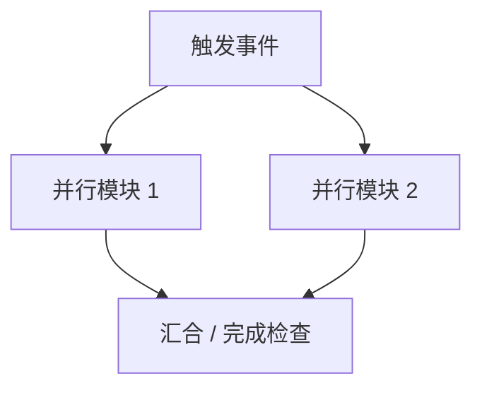

# SceneBehaviorGraph Agent 测试案例生成 Prompt

你需要为 `SceneBehaviorGraph Agent` 构造一批真正用于验证 Agent 准确性的 benchmark 测试案例。

原先 `docs/test/case` 中的内容只作为参考案例，用于理解 `SceneBehaviorGraph` 的表达方式；本次要生成的是正式测试用例，输出目录统一放在：

```text
test/test_case/
```

当前权威验证口径是：**所有测试都基于 Agent 最终输出的 `SceneBehaviorGraph` 做验证**。

所有标准答案，尤其是 `scene_behavior_graph.golden.json`，必须严格遵守当前 `SceneBehaviorGraph` schema 规范；不能只写概念性伪结构，也不能为了表达方便自造字段、改字段名或省略必填结构。

验证分为两个维度：

1. **最终行为图是否合规**
   - 必填 section 是否完整。
   - 字段结构是否符合当前 schema 模板。
   - 引用关系是否完整。
   - 是否没有旧 schema 污染。

2. **LLM 调度结果是否准确**
   - LLM 是否正确理解用户目标。
   - `modules / event_bus / state_model / behavior_rules / state_transition_rules / policies / completion_conditions / failure_observations` 是否符合该场景的真实运行意图。

不要把 LangGraph 中间节点结果作为主要验证对象。工具节点和模型节点的结果最终都会覆盖到 `SceneBehaviorGraph` 中，所以判卷对象只看最终图。

---

## 1. 输入材料

你需要基于已有场景材料构造测试案例。可参考但不要照抄旧 case：

```text
docs/test/case/
docs/business/test/
docs/business/SimulationSchema/
docs/design/agent_design.md
docs/test/case/agent_validation_plan.md
```

生成答案前必须优先对齐以下 schema 文档和模板：

```text
docs/business/SimulationSchema/4.SceneBehaviorGraph/
docs/business/SimulationSchema/README.md
```

如果模板中已有字段命名、层级、枚举值或数组结构，标准答案必须沿用模板写法；如确实需要新增字段，必须在 `expected_answer.md` 中说明新增原因，并保证不破坏现有 schema 语义。

每个新 case 的**场景输入**必须来自旧 case 的 `raw_description_summary`：

```text
docs/test/case/scene_XX/normalized_case.md#raw_description_summary
```

也就是说，构造正式测试 case 时，不要直接把旧 case 的 `normalized_user_goal` 当作输入。`normalized_user_goal`、旧 `scene_behavior_graph.golden.json`、旧 `test_assertions.json` 只能作为理解参考。

每个正式 case 的 Agent 输入应由两部分组成：

| 输入部分 | 来源 | 说明 |
|---|---|---|
| `raw_description_summary` | `docs/test/case/scene_XX/normalized_case.md` | 原始场景摘要，作为该场景的基础事实输入。 |
| `scene_image` | `docs/business/test/X.png` | 场景图片，作为空间布局、设备数量、相对位置、可达关系和显式连接判断依据。 |
| `case_user_goal` | 本次新构造 | 针对该 case 设计的用户目标，可以是基础目标、并行目标、连续事件目标、负向目标或语义干扰目标。 |

场景图片位于 `docs/business/test/`，必须结合图片设计 case。图片与场景编号的对应关系如下：

| 场景 | 图片路径 |
|---|---|
| `scene_01` | `docs/business/test/1.png` |
| `scene_02` | `docs/business/test/2.png` |
| `scene_03` | `docs/business/test/3.png` |
| `scene_04` | `docs/business/test/4.png` |
| `scene_05` | `docs/business/test/5.png` |
| `scene_06` | `docs/business/test/6.png` |
| `scene_07` | `docs/business/test/7.png` |
| `scene_08` | `docs/business/test/8.png` |
| `scene_09` | `docs/business/test/9.png` |

生成 case 时必须同时参考：

```text
raw_description_summary + 对应场景图片 + case_user_goal
```

其中 `raw_description_summary` 是文字输入基础，场景图片用于校验和补充场景空间关系，例如设备排列、物料起点、传送带方向、机械臂相对位置、可达区域、上下游关系和可能的断点 / 占位点。

如果某个 case 需要修改场景条件，例如删除连接、要求不存在的行为、加入旧 schema 干扰，必须在 case 中显式写出 `case_delta`，不要隐式修改输入。

当前只使用新方案：

```text
DeviceSpec + SceneDocument + 用户目标
  -> LangGraph Agent
  -> SceneBehaviorGraph
```

禁止使用或生成旧方案内容：

- `SceneTransportSchema`
- `SignalBusSchema`
- `SimPlan`
- `ExecutableSimGraph`
- `DeviceRuntimeProfile`
- `when_event`
- `when_state`
- `then_start_behavior`
- `then_emit_signal`

---

## 2. Case 类型边界

Case 类型沿用以下五类：

| 类型 | 含义 |
|---|---|
| `positive_basic` | 正向基础 case，验证基础流程能被正确建模。 |
| `parallel_collaboration` | 并行协作 case，验证多设备并行、共享资源、动态选择。 |
| `continuous_discrete_event` | 连续过程与离散事件 case，验证阈值、断点、阻塞、释放等连续状态到离散事件的建模。 |
| `negative_invalid` | 异常与负向 case，验证 Agent 能报告无法建模或拒绝硬编。 |
| `semantic_interference` | 语义干扰 case，验证 Agent 不被旧 schema、模糊表达或无关描述污染。 |

每个场景至少生成 6 个测试案例，并尽可能覆盖所有类型。

生成前必须先判断该场景适合覆盖哪些 case 类型：

- `negative_invalid` 必须包含。
- `semantic_interference` 必须包含。
- `positive_basic` 通常必须包含。
- `parallel_collaboration` 和 `continuous_discrete_event` 需要结合场景结构判断是否适用。
- 如果某个场景天然不适合某类 case，不要硬凑；请说明原因，并用更适合该场景的正向变体或动态策略变体补足到 6 个。

建议每个场景的 case 顺序：

```text
case_01_positive_basic
case_02_positive_basic_variant
case_03_parallel_collaboration_or_applicable_variant
case_04_continuous_discrete_event_or_applicable_variant
case_05_negative_invalid
case_06_semantic_interference
```

其中异常与负向 case、语义干扰 case 应尽量基于前面的正确 case 做局部修改，并明确说明修改点。

---

## 3. 每个场景的生成流程

对每个场景先输出一份 `case_design_overview.md`，再生成具体 case。

### 3.1 场景适用性判断

先判断该场景适合哪些 case 类型。

输出模板：

````markdown
# scene_XX Case Design Overview

## 场景摘要
- 场景名称：
- 主要设备：
- 主要物料：
- 显式连接：
- 典型工艺目标：

## Case 类型适用性判断

| Case 类型 | 是否适用 | 原因 | 本场景生成策略 |
|---|---|---|---|
| positive_basic | 是/否 | ... | ... |
| parallel_collaboration | 是/否 | ... | ... |
| continuous_discrete_event | 是/否 | ... | ... |
| negative_invalid | 是 | 必须包含 | 基于某个正向 case 做非法修改 |
| semantic_interference | 是 | 必须包含 | 加入旧 schema 或模糊自然语言干扰 |

## 本场景最终 case 列表

| Case ID | Case 类型 | 用户目标摘要 | 基于哪个 case 修改 | 主要验证点 |
|---|---|---|---|---|
| scene_XX_case_01 | positive_basic | ... | - | ... |
| scene_XX_case_02 | positive_basic | ... | - | ... |
| scene_XX_case_03 | parallel_collaboration | ... | - | ... |
| scene_XX_case_04 | continuous_discrete_event | ... | - | ... |
| scene_XX_case_05 | negative_invalid | ... | scene_XX_case_01 | ... |
| scene_XX_case_06 | semantic_interference | ... | scene_XX_case_01 | ... |
````

---

## 4. 单个测试案例输出格式

每个 case 独立一个目录：

```text
test/test_case/scene_XX/case_YY_<case_type>/
  README.md
  input.md
  scene_behavior_graph.golden.json
  expected_answer.md
  test_assertions.json
```

如果需要，也可以额外输出：

```text
  scene_delta.md
  notes.md
```

---

## 5. `README.md` 模板

````markdown
# scene_XX_case_YY_<case_type>

## 1. Case 元信息

| 字段 | 内容 |
|---|---|
| case_id | scene_XX_case_YY |
| case_type | positive_basic / parallel_collaboration / continuous_discrete_event / negative_invalid / semantic_interference |
| source_scene | scene_XX |
| based_on_case | 无 / scene_XX_case_YY |
| difficulty | low / medium / high |
| expected_result | generate_valid_graph / report_invalid_requirement / generate_with_assumptions |

## 2. 用户目标

用自然语言写出本 case 的用户目标。用户目标要像真实用户输入，不要写成 schema 字段列表。

## 3. 输入来源

| 字段 | 内容 |
|---|---|
| raw_description_summary_source | `docs/test/case/scene_XX/normalized_case.md#raw_description_summary` |
| scene_image | `docs/business/test/X.png` |
| raw_description_summary | 粘贴该场景原始摘要，不要改写成 normalized_user_goal |
| case_user_goal | 本 case 构造的真实用户目标 |

## 4. 场景修改点

如果该 case 基于已有正向 case 修改，需要说明：

- 修改了什么用户目标。
- 修改了什么场景条件。
- 修改后预期 Agent 应如何变化。

如果没有修改，写“无”。

## 5. 主要验证点

- ...
- ...
- ...

## 6. 期望 Agent 行为

说明 Agent 应该生成有效 `SceneBehaviorGraph`，还是应该报告无法建模 / 输出 assumptions / open_questions。
````

---

## 6. `input.md` 模板

`input.md` 用于明确这个 case 真正喂给 Agent 的输入，不放标准答案。

````markdown
# Input: scene_XX_case_YY

## 1. raw_description_summary

来源：`docs/test/case/scene_XX/normalized_case.md#raw_description_summary`

```text
粘贴原始 raw_description_summary 内容。
```

## 2. scene_image

```text
docs/business/test/X.png
```

请根据场景图片确认设备布局、连接方向、物料位置、机械臂可达关系、传送带方向和可能的断点 / 占位点。

## 3. case_user_goal

```text
写本 case 的用户目标。该目标应像真实用户输入，而不是 schema 字段清单。
```

## 4. case_delta

如果该 case 基于基础场景做修改，说明修改点；如果没有修改，写“无”。

示例：

- 删除某条显式连接。
- 要求某设备执行不存在的行为。
- 加入旧 schema 名称作为语义干扰。
- 把“谁空谁拿”“不要堵住传送带”等口语化约束加入用户目标。

## 5. expected_result

```text
generate_valid_graph / report_invalid_requirement / generate_with_assumptions
```
````

---

## 7. `scene_behavior_graph.golden.json` 模板

每个 case 必须输出一份 `scene_behavior_graph.golden.json`，作为该 case 的标准 `SceneBehaviorGraph` 语义答案。

它不要求和 Agent 输出逐字一致，但必须完整表达该 case 期望的最终行为图。后续验证时，`expected_answer.md` 用于人读解释，`test_assertions.json` 用于机器断言，`scene_behavior_graph.golden.json` 用于关键语义对比。

`scene_behavior_graph.golden.json` 必须是严格 schema 化的 JSON，而不是说明性摘要。字段命名、层级结构、数组 / 对象类型、事件模板、路由模板、规则模板、策略模板都必须按 `docs/business/SimulationSchema/4.SceneBehaviorGraph/` 中的规范书写。

模板：

```json
{
  "schema_type": "SceneBehaviorGraph",
  "schema_version": "0.1.0",
  "graph_id": "scene_XX_case_YY_behavior_graph",
  "source_case_id": "scene_XX_case_YY",
  "goal": {
    "raw_description_summary_source": "docs/test/case/scene_XX/normalized_case.md#raw_description_summary",
    "scene_image": "docs/business/test/X.png",
    "raw_description_summary": "...",
    "user_goal": "...",
    "assumptions": [],
    "open_questions": []
  },
  "modules": [],
  "event_bus": {
    "events": [],
    "topics": [],
    "routes": [],
    "subscriptions": []
  },
  "state_model": {},
  "behavior_rules": [],
  "state_transition_rules": [],
  "policies": [],
  "completion_conditions": [],
  "failure_observations": []
}
```

要求：

- 必须是合法 JSON。
- 必须严格符合 `SceneBehaviorGraph` schema 模板，不允许写成伪 JSON、伪字段或自然语言占位结构。
- 必须包含完整 `SceneBehaviorGraph` 顶层结构。
- `goal.raw_description_summary` 必须来自对应旧 case 的 `raw_description_summary`。
- `goal.scene_image` 必须指向对应场景图片。
- `goal.user_goal` 必须是本 case 新构造的用户目标。
- 不允许出现旧 schema 字段。
- 可以比真实 Runtime 所需字段更简化，但关键模块、事件、路由、状态、规则、策略、完成条件和异常观测必须完整。

---

## 8. `expected_answer.md` 模板

`expected_answer.md` 是该 case 的标准答案说明，用于人工理解和编写机器断言。它不是要求和 Agent 输出逐字一致，而是定义最终 `SceneBehaviorGraph` 必须覆盖的关键语义。

### 8.1 正向 case 答案模板

适用于：

- `positive_basic`
- `parallel_collaboration`
- `continuous_discrete_event`

````markdown
# Expected Answer: scene_XX_case_YY

## 1. 调度层面答案

### 1.1 用户目标覆盖度

#### 用户目标拆解

| 顺序 | 目标子项 | 必须覆盖 | 应落到行为图位置 |
|---|---|---|---|
| 1 | ... | 是 | `modules / behavior_rules / event_bus` |
| 2 | ... | 是 | `state_model / policies` |
| 3 | ... | 是 | `completion_conditions` |

#### 串行流程

用 Mermaid 或文本图表达串行关系。


#### 并行流程

如果存在并行或持续运行，用 Mermaid 或文本图表达；如果不存在，写“不适用”。



### 1.2 期望模块 `modules`

| module_id | 类型 | 作用 | 启动条件 | 完成条件 |
|---|---|---|---|---|
| ... | sequential / parallel / continuous | ... | ... | ... |

### 1.3 期望事件 `event_bus.events`

| event_id | kind | 发送者 | payload 关键字段 | 作用 |
|---|---|---|---|---|
| `runtime.sim_start` | global | Runtime | `run_id` | 启动仿真 |
| ... | device_signal / control / observation / global | ... | ... | ... |

### 1.4 期望事件路由 `event_bus.routes`

| route_id | from | to.type | to.id | delivery | 传递参数 | 作用 |
|---|---|---|---|---|---|---|
| ... | ... | rule / topic / runtime / device / module | ... | direct / broadcast / conditional | ... | ... |

### 1.5 期望状态模型 `state_model`

| 状态变量 | 初始值 / 来源 | 运行时含义 | 被哪些规则或策略使用 |
|---|---|---|---|
| `device_states` | ... | 设备当前状态 | ... |
| `active_actions` | ... | 当前执行中的行为 | ... |
| `resource_locks` | ... | 互斥资源占用 | ... |
| ... | ... | ... | ... |

### 1.6 期望行为规则 `behavior_rules`

| rule_id | trigger | guard 核心条件 | policy | action | 期望效果 |
|---|---|---|---|---|---|
| ... | ... | ... | ... | ... | ... |

### 1.7 期望状态迁移 `state_transition_rules`

| transition_id | 触发来源 | effects | emit 事件 | 作用 |
|---|---|---|---|---|
| ... | behavior_started / behavior_completed / event / observation | ... | ... | ... |

### 1.8 期望策略函数 `policies`

| policy_id | 策略类型 | 输入状态 | 输出 / 决策 | 解决的问题 |
|---|---|---|---|---|
| ... | shared_pool_claim / backpressure / resource_lock / queue_wait / deadlock_detection | ... | ... | ... |

### 1.9 期望完成条件 `completion_conditions`

| condition_id | 条件表达 | 依赖状态 |
|---|---|---|
| ... | ... | ... |

### 1.10 期望异常观测 `failure_observations`

| observation_id | 触发条件 | 期望说明 |
|---|---|---|
| ... | ... | ... |

## 2. 规范层面答案

### 2.1 必填 section

最终 `SceneBehaviorGraph` 必须包含：

- `goal`
- `modules`
- `event_bus`
- `state_model`
- `behavior_rules`
- `state_transition_rules`
- `policies`
- `completion_conditions`
- `failure_observations`

### 2.2 字段结构要求

- `event_bus.events` 中每个事件必须包含 `event_id / kind / payload_schema / description`。
- `event_bus.routes` 中每条路由必须包含 `route_id / from / to / delivery`。
- `behavior_rules` 中每条规则必须包含 `rule_id / module_id / trigger / guard / policy / action`。
- `state_transition_rules` 中每条规则必须包含 `transition_id / trigger / effects`。
- `policies` 中每个策略必须包含 `policy_id / policy_type / inputs / outputs / description`。

### 2.3 引用关系完整性

- 所有 `instance_id` 必须来自 `SceneDocument.instances`。
- 所有 `behavior_id` 必须来自对应设备 `DeviceSpec.transport_behaviors`。
- 所有 `trigger.event_id` 必须已在 `event_bus.events` 注册，或可由 topic subscription 产生。
- 所有 `routes[].from` 必须已在 `event_bus.events` 注册。
- 所有 `trigger.payload.xxx` 必须能从对应事件的 `payload_schema` 推导。
- 所有 `guard / policy / action / effects` 引用的状态变量必须存在于 `state_model`。
- 所有 `effects.emit` 的事件必须已在 `event_bus.events` 注册。

### 2.4 禁止项

最终图不得出现：

- `SceneTransportSchema`
- `SignalBusSchema`
- `SimPlan`
- `ExecutableSimGraph`
- `DeviceRuntimeProfile`
- `when_event`
- `when_state`
- `then_start_behavior`
- `then_emit_signal`
````

### 8.2 异常与负向 case 答案模板

适用于：

- `negative_invalid`

````markdown
# Expected Answer: scene_XX_case_YY

## 1. Case 修改说明

| 字段 | 内容 |
|---|---|
| based_on_case | scene_XX_case_YY |
| 修改类型 | 缺连接 / 缺设备能力 / 错误端口 / 不支持能力 / 不支持重规划 |
| 修改内容 | ... |

## 2. 期望 Agent 行为

Agent 不应硬编非法 `SceneBehaviorGraph`。期望行为是：

- 明确指出无法建模或连接不合理的原因。
- 给出可执行修改建议。
- 如果仍输出草案，必须在 `goal.assumptions / failure_observations / validation_report` 中标注风险。

## 3. 必须识别的问题

| 问题 ID | 问题描述 | 应出现的位置 |
|---|---|---|
| ... | ... | `validation_report / explanation / failure_observations` |

## 4. 不允许出现的错误输出

- 不允许凭空发明不存在的设备。
- 不允许凭空发明不存在的 `behavior_id`。
- 不允许忽略缺失连接继续生成完整成功图。
- 不允许输出旧 schema。

## 5. 规范层面答案

如果输出 `SceneBehaviorGraph` 草案，仍必须满足基础结构合规；如果拒绝生成最终图，则必须输出清晰失败报告。
````

### 8.3 语义干扰 case 答案模板

适用于：

- `semantic_interference`

````markdown
# Expected Answer: scene_XX_case_YY

## 1. 干扰信息说明

| 干扰类型 | 内容 | 期望处理 |
|---|---|---|
| 旧 schema 干扰 | 用户提到 SimPlan / SignalBusSchema 等 | 忽略旧 schema，仍输出 SceneBehaviorGraph |
| 模糊表达 | 用户说“别堵住”“谁空谁拿”等 | 转换为策略、状态或 assumptions |
| 无关描述 | 与仿真目标无关的信息 | 不进入核心行为图 |

## 2. 期望 Agent 行为

- 正确抽取真实用户目标。
- 不被旧 schema 或无关信息污染。
- 必要时在 `goal.assumptions` 中说明解释假设。
- 最终图仍然只使用 `SceneBehaviorGraph`。

## 3. 调度层面答案

沿用正向 case 的答案模板，重点补充：

- 哪些用户描述被视为真实目标。
- 哪些用户描述被视为干扰信息。
- 模糊描述如何映射为 `state_model / behavior_rules / policies`。

## 4. 规范层面答案

- 必填 section 完整。
- 不出现旧 schema 字段。
- 引用关系完整。
- 口语化目标必须能追溯到最终图中的模块、事件、状态或策略。
````

---

## 9. `test_assertions.json` 模板

每个 case 必须给出机器可读断言，用于验证 Agent 最终输出的 `SceneBehaviorGraph`。

```json
{
  "case_id": "scene_XX_case_YY",
  "case_type": "positive_basic",
  "expected_result": "generate_valid_graph",
  "input_assertions": {
    "raw_description_summary_source": "docs/test/case/scene_XX/normalized_case.md#raw_description_summary",
    "scene_image": "docs/business/test/X.png",
    "must_use_raw_description_summary_as_scene_input": true,
    "must_use_scene_image_as_layout_input": true,
    "must_not_use_normalized_user_goal_as_input": true
  },
  "schema_assertions": {
    "required_sections": [
      "goal",
      "modules",
      "event_bus",
      "state_model",
      "behavior_rules",
      "state_transition_rules",
      "policies",
      "completion_conditions",
      "failure_observations"
    ],
    "forbidden_fields": [
      "scene_transport_schema",
      "signal_bus_schema",
      "sim_plan",
      "executable_sim_graph",
      "device_runtime_profile",
      "when_event",
      "when_state",
      "then_start_behavior",
      "then_emit_signal"
    ],
    "rule_required_fields": [
      "rule_id",
      "module_id",
      "trigger",
      "guard",
      "policy",
      "action"
    ]
  },
  "semantic_assertions": {
    "must_have_goal_requirements": [],
    "must_have_modules": [],
    "must_have_events": [],
    "must_have_routes": [],
    "must_have_state_variables": [],
    "must_have_behavior_rules": [],
    "must_have_transition_effects": [],
    "must_have_policies": [],
    "must_have_completion_conditions": [],
    "must_have_failure_observations": []
  },
  "reference_assertions": {
    "all_action_instances_exist": true,
    "all_action_behaviors_exist_in_device_spec": true,
    "all_trigger_events_registered": true,
    "all_route_sources_registered": true,
    "all_state_references_declared": true,
    "all_payload_references_declared": true,
    "all_emitted_events_registered": true
  },
  "negative_assertions": {
    "must_report_invalid_reason": false,
    "must_not_invent_devices": true,
    "must_not_invent_behaviors": true,
    "must_not_ignore_invalid_connections": true
  }
}
```

`case_type` 和 `expected_result` 可选值：

```text
case_type:
  positive_basic
  parallel_collaboration
  continuous_discrete_event
  negative_invalid
  semantic_interference

expected_result:
  generate_valid_graph
  report_invalid_requirement
  generate_with_assumptions
```

---

## 10. 输出要求

最终输出必须直接生成文件内容，不要只给建议。

每个场景至少输出：

```text
test/test_case/scene_XX/
  case_design_overview.md
  case_01_positive_basic/
    README.md
    input.md
    scene_behavior_graph.golden.json
    expected_answer.md
    test_assertions.json
  case_02_positive_basic_variant/
    README.md
    input.md
    scene_behavior_graph.golden.json
    expected_answer.md
    test_assertions.json
  case_03_.../
    README.md
    input.md
    scene_behavior_graph.golden.json
    expected_answer.md
    test_assertions.json
  case_04_.../
    README.md
    input.md
    scene_behavior_graph.golden.json
    expected_answer.md
    test_assertions.json
  case_05_negative_invalid/
    README.md
    input.md
    scene_behavior_graph.golden.json
    expected_answer.md
    test_assertions.json
  case_06_semantic_interference/
    README.md
    input.md
    scene_behavior_graph.golden.json
    expected_answer.md
    test_assertions.json
```

生成时请遵守：

- 每个 case 的用户目标要像真实用户输入，不要写成 schema 字段清单。
- 每个 case 的 `scene_behavior_graph.golden.json` 必须严格按照 `docs/business/SimulationSchema/4.SceneBehaviorGraph/` 的 schema 模板生成。
- 标准答案中不得自造 schema 层级、字段名或旧字段；如果需要扩展字段，必须在 `expected_answer.md` 中解释扩展原因。
- 每个 case 的场景输入必须引用并粘贴对应旧 case 的 `raw_description_summary`。
- 每个 case 必须引用对应场景图片，图片路径为 `docs/business/test/X.png`。
- 设计 case 时必须结合场景图片判断设备布局、连接关系、机械臂可达性、传送带方向和断点 / 占位点。
- 不要把旧 case 的 `normalized_user_goal` 当作本次 case 输入；它只能作为理解参考。
- 每个 case 必须有对应 `input.md`。
- 每个 case 必须有对应 `scene_behavior_graph.golden.json`。
- 每个 case 必须有对应 `expected_answer.md`。
- 每个 case 必须有对应 `test_assertions.json`。
- 异常与负向 case 必须说明基于哪个正确 case 修改，以及修改了什么。
- 语义干扰 case 必须说明哪些内容是干扰，Agent 应如何处理。
- 传送带场景必须考虑断点、占位、队列、下游释放等建模可能性，不要简单写成 entry 到 exit 的瞬移。
- 如果场景不适合某类 case，要在 `case_design_overview.md` 中说明原因，并用合理替代 case 补足 6 个。
- 所有答案都必须服务于最终图验证，不要把中间 LangGraph 节点状态作为主要断言。
