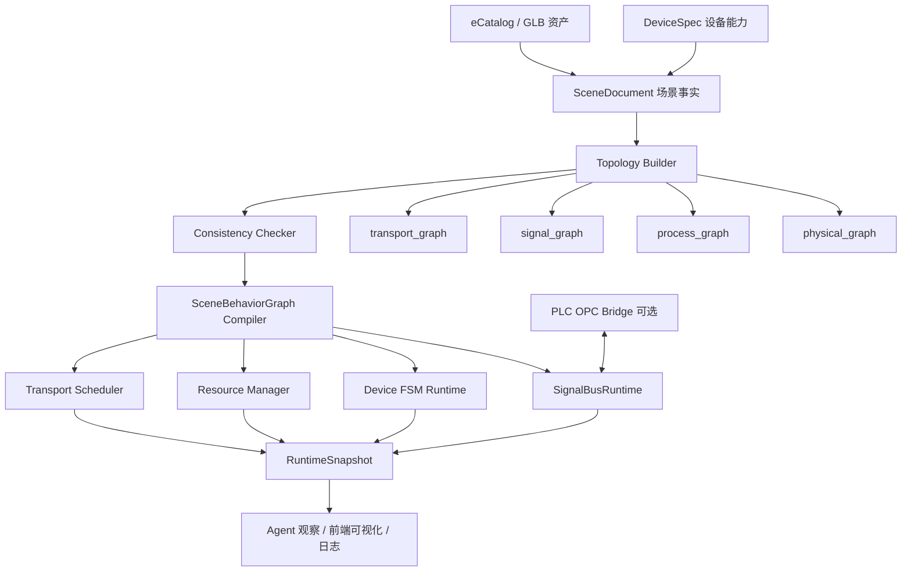

# Visual Components 信号、接口 Schema 与复刻方案调研

**调研目标**：结合 `docs/vc_topology_agent_research.md` 中“复刻/超越 Visual Components（VC）”的目标，基于本机 VC 4.8 Premium 可读资源，梳理 VC 的信号传递机制、设备接口建模方式、工艺/运输建模方式，以及我们复刻方案中应落地的功能清单。

**本地调研对象**：

- `D:\Visual Components\Visual Components Premium 4.8\Python\Commands\...` 下的 Python 命令和 Wizard 脚本。
- `D:\Visual Components\Visual Components Premium 4.8\SrcTemplates\Python Editor\Auto Complete\api.xml` 与 `constants.xml`。
- `D:\Visual Components\Visual Components Premium 4.8\VisualComponents.Connectivity.*.xml` 连接器文档。
- 本项目现有 schema：`docs/business/SimulationSchema/1.DeviceSpec/schema.json`、`2.SceneDocument/schema.json`、`4.SceneBehaviorGraph/schema.json`、`4.SceneBehaviorGraph/event_bus/event_bus.md`。

> 重要边界：这里没有、也不应该反编译 VC 的闭源 DLL。本文只基于 VC 安装包内可读的 Python 脚本、API 自动补全文档和 Connectivity XML 文档做机制归纳。因此下面说的“源码”更准确地指“可读脚本层 + 公开 API 元数据”，不是 VC 引擎内部实现。

---

## 1. 先回答你的核心疑问：VC 的意义到底是什么？

你的直觉基本是对的：VC 不是在真实物理层面模拟“刀具切削材料、机床受力、热变形、夹具刚度、工序质量漂移”这种连续加工物理。它更常见的建模方式是：

1. 设备有可配置的接口、容器、路径、传感器、信号、动作。
2. 产品按照预先定义的流程进入某个资源。
3. 设备执行一段动作、延时、状态变化或机器人程序。
4. 完成后发出信号，把物料交给下一节点。

所以 VC 的核心价值不是“真实还原每一道加工机理”，而是工业仿真的另一个层级：**离散事件仿真 + 产线布局验证 + 节拍/物流/阻塞分析 + 机器人/PLC 行为联调 + 可视化沟通**。

换句话说：

- 如果你要研究“某个切削参数会不会烧刀”，VC 不是主力工具。
- 如果你要研究“一条自动线怎么布置、机器人能不能够到、输送线会不会堵、PLC 信号能不能跑通、产能瓶颈在哪里”，VC 是有意义的。

这也解释了为什么 VC 里很多“工序”看起来像动画：在产线级仿真中，一道加工通常被抽象为 `ProcessDelay + 状态变化 + 可选动作`。它牺牲微观加工真实度，换取大场景的搭建效率、控制逻辑验证和节拍分析能力。

---

## 2. 为什么已经编排好了动作，还需要信号传递？

因为“编排好的动作”只能描述**开放环**脚本：什么时候做什么。信号传递把它变成**闭环**系统：谁完成了、谁阻塞了、谁允许下一个动作、谁等待外部 PLC、谁抢占资源。

没有信号时，产线像一段排好的动画：

```text
传送带移动 -> 机器人抓取 -> 机床开门 -> 加工延时 -> 出料
```

有信号后，产线才像一个可运行系统：

```text
传送带 part_ready=True
  -> 机器人 idle 且 gripper_empty 才允许 pick
  -> 机器人 pick_done=True
  -> 机床 door_closed=True 且 resource_available 才允许 start_process
  -> 机床 process_done=True
  -> 下游 capacity_available=True 才允许 transport_out
```

信号存在的实际价值：

- **同步**：设备 A 的完成事件唤醒设备 B，而不是靠固定时间猜测。
- **互锁**：门未关、夹爪未空、下游满载时，动作不能继续。
- **分支**：同一段逻辑可以根据 `part_type`、`quality`、`blocked` 走不同路径。
- **资源协调**：多个设备抢同一个机器人、升降台、缓存位时，需要事件和状态仲裁。
- **外部联动**：PLC/OPC UA/S7 等外部控制器只能通过变量/信号读写参与仿真。
- **复用设备模型**：设备动作可以封装成行为模块，用信号口暴露能力；同一个设备不需要为每条产线重写脚本。

所以：**编排是“默认剧本”，信号是“运行时事实和控制面”。** VC 需要信号，是因为工业线不是一条确定动画，而是很多设备在运行时互相等待、互相解锁、互相传递状态。

---

## 3. VC 机制分层总览

VC 的建模大致可以拆成五层：

| 层 | VC 对象/资源 | 解决的问题 | 对我们复刻的启发 |
|---|---|---|---|
| 组件层 | `vcComponent`、`vcNode`、`vcBehaviour` | 一个设备由节点树和行为对象组成 | `DeviceSpec` 不只描述 3D 资产，也要描述行为能力 |
| 物理/接口层 | `vcConnector`、`vcFlow`、`vcSimInterface`、`vcSimInterfaceSection`、`vcSimInterfaceField` | 设备能否吸附、连接、装夹、挂载、匹配 | 要有端口级 schema，不能只有设备级连接 |
| 信号层 | `vcSignal`、`vcBoolSignal`、`vcBooleanSignalMap`、`OnSignal`、`OnSignalTrigger` | 设备间传递布尔/数值/组件/字符串状态 | `signal_ports` + `signal_edges` + `SignalBusRuntime` 是必需品 |
| 工艺/运输层 | `vcProcessController`、`vcProcessExecutor`、`vcTransportSystem`、`vcTransportNode`、`vcTransportLink`、`vcProductType` | 产品流、运输路径、加工步骤、资源执行 | `process_edges` 和 transport reachability 应独立于物理边 |
| 外部连接层 | `VisualComponents.Connectivity.*` | 和 OPC UA、Siemens S7、机器人控制器等同步变量 | 后期可做 PLC/OPC Bridge，但不应塞进 MVP 核心 |

本项目现有 schema 已经走在正确方向上：`DeviceSpec` 拆出 `physical_interfaces`、`process_ports`、`signal_ports`、`interface_bindings`、`transport_behaviors`；`SceneDocument` 拆出 `process_edges`、`physical_edges`、`signal_edges`；`SceneBehaviorGraph.event_bus` 负责事件定义和路由。这比简单模仿 VC 手工 Process Modeling 更适合做 Agent 驱动的产线生成。

---

## 4. VC 的信号传递机制

### 4.1 基础信号：`vcSignal` / `vcBoolSignal`

从 `api.xml` 看，基础信号对象有以下核心成员：

- `vcSignal.connect(signal, [connect_in_gui])`：连接另一个信号。
- `vcSignal.disconnect(...)`：断开连接。
- `vcSignal.Connections`：连接到的行为/信号列表。
- `vcSignal.OnValueChange`：值变化事件。
- `vcBoolSignal.Value`：当前布尔值。
- `vcBoolSignal.signal([value])`：把当前值或传入值广播给连接对象，并触发连接脚本的 `OnSignal`。

关键点：**单纯有值不等于有事件。** VC 脚本里常用 `signal.signal(True/False)` 作为“发出信号”的动作，而不是只写 `Value`。这对我们很重要：`RuntimeSnapshot.signal_values` 记录的是当前状态，但 `SignalBusRuntime.emit(...)` 才是一次事件投递。

推荐映射到我们 runtime：

```text
vcBoolSignal.Value        -> RuntimeSnapshot.signal_values[signal_id].latest_value
vcBoolSignal.signal(v)    -> SignalBusRuntime.emit(signal_id, payload/value)
vcSignal.Connections      -> SceneDocument.signal_edges + event_bus.routes
OnSignal(signal)          -> 订阅者 callback / rule trigger
```

### 4.2 信号映射口：`vcBooleanSignalMap`

VC 不只支持单个 signal，还支持类似 PLC I/O 板卡的端口映射：`vcBooleanSignalMap`。

`api.xml` 中该类的关键能力：

- `PortCount`、`StartIndex`、`EndIndex`、`Ports`：定义端口范围。
- `Direction`：输入/输出/未定义，对应常量 `VC_SIGNALMAP_DIRECTION_INPUT`、`OUTPUT`、`UNDEFINED`。
- `addPort(index, signal)`：把某个端口绑定到一个 `vcBoolSignal`。
- `connect(indexPort1, SignalMap2, indexPort2)`：端口对端口连接。
- `connect(indexPort1, signal)`：端口对单信号连接。
- `input(index)` / `output(index, value)`：读输入口或写输出口。
- `getConnectedExternalSignals(index)` / `getConnectedExternalPorts(index)`：查询跨组件连接。
- `OnSignalTrigger(signal_map, port, value)`：映射端口值变化时触发。

这说明 VC 的信号并不只是“设备 A 调函数给设备 B”，而是更接近工业控制中的**端口化 I/O 模型**。机器人、PLC、工装、传感器都可以通过端口号连接。

推荐映射到我们 schema：

```json
{
  "signal_ports": [
    {
      "port_id": "robot_1.output_01",
      "direction": "output",
      "value_type": "boolean",
      "semantic": "grasp_tool_1_when_true_release_when_false",
      "retention": "latest_value"
    }
  ]
}
```

### 4.3 Machine Wizard 证据：机床信号是 PLC 风格命名

`Python\Commands\Wizards\MachineWizard.py` 会给机床创建典型 PLC 风格信号：

- `TO_PLC_ProcessIsRunning`
- `FROM_PLC_StartProcess`
- `TO_PLC_DoorIsClosed`
- `TO_PLC_DoorIsOpen`
- `FROM_PLC_OpenDoor`
- `FROM_PLC_CloseDoor`

其中 `FROM_PLC_*` 信号会设置 `Connections = [script]`，也就是 PLC/外部/其他组件发信号后，PythonScript 的 `OnSignal(signal)` 被触发。

`Python\Commands\Wizards\MachineScript.py` 中的逻辑更直接：

```python
def OnSignal(signal):
  if signal in triggerSignals:
    tasks.append([signal.Name, signal.Value])

def OnRun():
  while True:
    condition(lambda: tasks)
    signal_name, signal_val = tasks.pop(0)
    if signal_name == "FROM_PLC_StartProcess" and signal_val:
      machineProcess(processingTime)

def machineProcess(time, part=None):
  running.signal(True)
  delay(time)
  running.signal(False)
```

这段非常关键：VC 默认机床加工过程本质是**事件触发 -> 进入任务队列 -> 延时表示加工 -> 发 running/done 类状态信号**。这就是你看到“设备动作一演，就算工序完成”的根源。

### 4.4 Sensor Wizard 证据：传感器也是信号生产者

`Python\Commands\Wizards\SensorWizard.py` 会：

- 创建 `VC_COMPONENTPATHSENSOR`。
- 根据配置创建 `VC_BOOLEANSIGNAL` 或 `VC_COMPONENTSIGNAL`。
- 把 signal 挂到 `sensor.BoolSignal` 或 `sensor.ComponentSignal`。
- 把 signal 的 `Connections` 接到 PythonScript。
- 生成脚本使用 `triggerCondition(lambda: getTrigger() == theSignal and theSignal.Value)` 等待触发。

这说明传感器在 VC 里不是“每帧扫几何然后自动调度全局行为”，而是一个**把局部检测结果转成信号的行为模块**。我们复刻时也应把传感器视为 event producer。

### 4.5 Robot Action Script 证据：机器人动作由输出端口触发

`Python\Commands\ActionScript\action_script.py` 是一个很好的“信号驱动动作”样例。文件头注释里直接写了默认信号映射：

- 01-16：`grasp/release`
- 17-32：`trace_on/trace_off`
- 33-48：`mount_tool/unmount_tool`
- 49-80：`trace_extTCP_on/off`
- 81：`swept_volume_on/off`

脚本从 robot executor 读取 `DigitalOutputSignals` / `DigitalInputSignals`，并把 `outputmap.OnSignalTrigger = OutputTriggered`。当某个输出端口变为指定值时，`OutputTriggered(map, port, value)` 查找 action 表，调用 `Grasp`、`Release`、`MountTool`、`UnmountTool`、`TraceOn` 等动作。

这进一步证明：VC 中很多机器人“动作编排”不是硬编码在全局流程里，而是通过端口值触发局部 action。我们需要类似机制：机器人行为不应只是一串动画 timeline，而应该有 `signal_ports`、action binding、resource lock、completion signal。

---

## 5. VC 的设备接口 / Schema 机制

VC 有两类容易混淆的“接口”：

1. `vcConnector` / `vcFlow`：偏物流、容器、路径、物料流动端口。
2. `vcSimInterface` / Section / Field：偏组件装配、物理吸附、工具挂载、兼容性匹配、抽象接口。

### 5.1 `vcConnector` / `vcFlow`：物流端口图

`api.xml` 中 `vcConnector` 的核心属性：

- `Behaviour`：该 connector 属于哪个行为对象。
- `Connection`：连接到的另一个 connector。
- `Index`、`Name`：端口序号和名称。
- `Type`：输入、输出、双向等，常量包括 `VC_CONNECTOR_INPUT`、`VC_CONNECTOR_OUTPUT`、`VC_CONNECTOR_INPUT_OUTPUT`。
- `CapacityTest`：容量测试方式。

`vcFlow` 的核心属性：

- `Connectors`、`ConnectorCount`：端口列表。
- `CapacityAvailable`：容量可用状态。
- `Statistics`：统计状态绑定。

这正是 `docs/vc_topology_agent_research.md` 里说的端口图：

```text
Component -> Behaviour/Flow -> Connector -> Connection -> Connector -> Behaviour/Flow -> Component
```

复刻建议：

- `DeviceSpec.process_ports` 表达设备在工艺流中的入口/出口能力。
- `DeviceSpec.physical_interfaces` 表达真实几何锚点。
- `SceneDocument.process_edges` 表达物料/工艺流向。
- `SceneDocument.physical_edges` 表达真实接口连接。
- 不要把“设备 A 连设备 B”做成设备级一条边；必须是端口级边。

### 5.2 `vcSimInterface`：装配/吸附/兼容性接口

`vcSimInterface` 的核心 API：

- `canConnect(interface)`：判断两个接口能否连接。
- `connect(interface, [retain_offset])`：连接接口，可选择保留偏移。
- `disconnect(...)` / `unConnect(...)`：断开连接。
- `createSection(name)` / `deleteSection(section)`：接口可以包含多个 section。
- 事件：`OnConnect`、`OnDisconnect`、`OnMatch`。
- 属性：`AngleTolerance`、`DistanceTolerance`、`IsAbstract`、`IsConnected`、`ConnectedComponent(s)`、`ConnectedSection(s)`、`Sections`、`ConnectionEditName`。

`vcSimInterfaceSection`：

- `Frame`：连接锚点坐标系。
- `Fields`：兼容性字段列表。
- `ConnectedToSection`：连接目标 section。

`vcSimInterfaceField`：

- `Type`：字段类型。
- `Name`：字段名。
- `Properties`：字段参数。
- `Index`：字段顺序。

常量中能看到这些接口字段类型：

- `VC_ONETOONEINTERFACE`
- `VC_ONETOMANYINTERFACE`
- `VC_INTEGERCOMPATIBILITYFIELD`
- `VC_PROCESSORFIELD`
- `VC_SIGNALFIELD`

这说明 VC 的接口 schema 是**section + field 的兼容性模型**：一个接口不是只靠名字匹配，而是靠字段类型、顺序、属性、容差等共同决定是否可连接。

复刻建议：给 `DeviceSpec.physical_interfaces[]` 增强字段：

```json
{
  "interface_id": "machine_1.door_side_fixture",
  "kind": "mount | flow_anchor | sensor_anchor | tool_mount",
  "direction": "input | output | bidirectional | none",
  "frame": { "position": [0, 0, 0], "rotation": [0, 0, 0] },
  "snap_tolerance": { "distance_mm": 5, "angle_deg": 3 },
  "compatibility_fields": [
    { "type": "integer_compatibility", "name": "fixture_class", "value": 1001 },
    { "type": "signal", "name": "re_evaluation_request", "signal_port": "machine_1.re_evaluate" }
  ]
}
```

### 5.3 Wizard 中的接口用法

`MachineWizard.py` 会创建：

- `WorksProcessInterface`：`VC_ONETOONEINTERFACE`，带 `AttachWorksProcess` section、`Parent` hierarchy field、integer compatibility field。
- `ResourceInterface`：`VC_ONETOMANYINTERFACE`，且 `IsAbstract = True`，用于资源/Process Manager 连接。
- `Re_evaluateMT_Signal`、`TransSignal`、`Resourcing` 等行为与接口联动。

`SensorWizard.py` 会创建带 `VC_PROCESSORFIELD` 的 processor interface，把 sensor 作为处理器字段暴露出去。

`ActionScript.py` 和 `vcHelpers\Robot2.py` 中工具挂载逻辑会使用类似 `iface.canConnect(other_iface)` 与 `iface.connect(other_iface, True/False)` 的模式。

因此，VC 的“接口”不仅是几何吸附点，也是行为和信号注入点。我们复刻时不应把 `physical_interfaces` 设计成纯坐标；它必须能绑定 process port、signal port、resource contract。

---

## 6. VC 的工艺/运输建模机制

### 6.1 Process Controller 是全局工艺中枢

`api.xml` 中 `vcProcessController` 暴露的核心属性：

- `FlowTable` / `FlowTable2`
- `TransportSystem`
- `FlowGroupManager`
- `ProductTypeManager`
- `ProductMatcher`
- `ProcessManager`
- `ProcessData`

这表明 VC 的 Process Modeling 不是一条简单连线，而是全局 controller 管：产品类型、流程组、流程表、运输系统、过程资源。

我们对应关系：

```text
vcProcessController       -> SceneBehaviorGraph compiler/runtime orchestration
vcProductType             -> materials / product type spec
vcProcessFlowGroup        -> material flow group / product family
vcProcessFlowTable2       -> process_edges + process sequence
vcTransportSystem         -> derived transport graph / reachability index
vcProcessExecutor         -> Device runtime module / behavior executor
```

### 6.2 TransportSystem 是可达性图

`vcTransportSystem` 的关键方法和属性：

- `Nodes`、`Links`、`Controllers`
- `createTransportLink(source, destination, implementer, group)`
- `deleteTransportLink(link)`
- `findSolution(source, destination, flowGroup)`
- `findAllLinksBetweenNodeSets(sourceNodes, destinationNodes, group)`
- 事件：`OnTransportNodeAdded`、`OnTransportLinkAdded`、`OnTransportLinkRemoving` 等。

`vcTransportLink`：

- `Source`
- `Destination`
- `Implementer`
- `SupportedGroup`
- `Properties`

`vcTransportNode`：

- `TransportLinks`
- `ProcessExecutor`
- `ComponentContainer`
- `beginTransportOut(product)`
- 事件：`OnProductArriving`、`OnProductLeaving`、`OnTransportTargetRequested`

这说明 VC 的运输不是仅靠物理 connector 自动推导，而是有单独的 transport graph。`cmdAutoLink.py` 也证明了这一点：它读取 `process_controller.FlowTable2`、`flow_sequence.FlowSteps`、各 process implementation 的 `Executor.TransportNode`，再调用 `transport_system.createTransportLink(...)` 自动补运输边。

复刻建议：我们应在 `SceneDocument` 基础上生成一个派生物：

```text
PlantGraph / DeviceTopologyGraph
  physical_graph: physical_edges + inferred physical interface adjacency
  process_graph: process_edges / process sequence
  signal_graph: signal_edges / event routes
  transport_graph: process_graph + available transport behaviors + resource implementer
```

### 6.3 MachineWizard 的默认 process sequence 证明“工序 = 语句链”

`MachineWizard.py` 在 `addProcessModel()` 中会创建：

- `rTransportNode`
- `rProcessExecutor`
- `VC_STATEMENT_TRANSPORTIN`
- `VC_STATEMENT_SETSTATISTICSSTATE`
- `VC_STATEMENT_PROCESSDELAY`
- `VC_STATEMENT_MOVEJOINT`（如有门/轴动作）
- `VC_STATEMENT_TRANSPORTOUT`

这正好解释了 VC 的应用边界：一台机床的“加工”默认不是微观物理，而是一串可调语句：进料、状态设为 Busy、延时、可选开关门/移动轴、出料。对于产线级仿真，这已经足够回答节拍、阻塞、设备利用率、物流可达性问题。

---

## 7. VC 的外部连接机制：变量映射，而不是设备内核魔法

`VisualComponents.Connectivity.Core.xml` 暴露了 Connectivity 的基本模型：

- Connection Plugin 下有 server 和 variable group。
- `VariableGroupItem` 表示 simulation variable（Signal 或 Property）和 server-side `IValueItem` 的映射。
- `GroupUpdateMethod.ImmediateEventBased`：变量对基于值变化事件逐个同步。
- `GroupUpdateMethod.Cyclic`：变量对按周期批量同步。
- `SimulationWriteQueue` 负责把外部写入排进仿真线程，避免递归/线程问题。

OPC UA 文档显示：

- `ServerConnectionSettings.ServerUrl`
- 认证方式：匿名、用户名密码、证书。
- `UseSecureConnection`
- `VariableGroupSettings.ServerMonitorSamplingInterval`
- `SubscriptionPublishInterval`

Siemens S7 文档显示：

- `S7AddressParser.ParseAddress(...)` 支持 `M0.1`、`IW12` 等地址格式。
- `ReadWriteBatcher` 会把多个变量按连续内存区域分组，使用批量读写降低请求数。

对我们而言，PLC/OPC 不应在 MVP 中变成强依赖。更合适的分层是：

```text
DeviceSpec.signal_ports / SceneDocument.signal_edges / EventBus
    -> 内部仿真可运行
PLC/OPC Bridge
    -> 可选，把内部 signal/event 映射到外部变量地址
```

---

## 8. 映射到我们现有 schema 的结论

### 8.1 现有设计正确的地方

`1.DeviceSpec/schema.json` 已要求：

- `asset`
- `params_schema`
- `physical_interfaces`
- `process_ports`
- `signal_ports`
- `interface_bindings`
- `transport_behaviors`
- `runtime_contract`
- `type_specific_contract`

`2.SceneDocument/schema.json` 已要求：

- `instances`
- `materials`
- `process_edges`
- `physical_edges`
- `signal_edges`
- `runtime_config`

`4.SceneBehaviorGraph/event_bus/event_bus.md` 已定义：

- `event_bus.events`：注册事件/信号。
- `event_bus.topics`：广播主题。
- `event_bus.subscriptions`：topic 消费者。
- `event_bus.routes`：事件路由。
- `SignalBusRuntime`：实际校验、路由、投递、写事件日志。
- `RuntimeSnapshot.signal_values`：保存最新值和队列状态。

这与 VC 的分层高度一致，而且更适合 Agent 编译：VC 是手工建模优先，我们是 schema + compiler + runtime 优先。

### 8.2 建议补强的 schema 字段

#### `DeviceSpec.signal_ports[]`

建议补：

```json
{
  "port_id": "machine.start_process",
  "direction": "input",
  "value_type": "boolean | integer | real | string | component | object",
  "payload_schema": {},
  "edge_trigger": "on_rising_edge | on_falling_edge | on_change | level",
  "retention": "latest_value | event_log | checkpoint_only",
  "default_value": false,
  "debounce_ms": 0,
  "semantic": "外部请求机床启动一次加工循环"
}
```

对应 VC：`vcBoolSignal.Value`、`signal()`、`OnSignal`、`vcBooleanSignalMap.Direction`、`OnSignalTrigger`。

#### `DeviceSpec.physical_interfaces[]`

建议补：

```json
{
  "interface_id": "conveyor.exit_anchor",
  "interface_type": "flow_anchor | mount | tool | sensor | fixture",
  "frame": { "position": [0, 0, 0], "rotation": [0, 0, 0] },
  "direction": "input | output | bidirectional | none",
  "snap_tolerance": { "distance_mm": 5, "angle_deg": 3 },
  "compatibility_fields": [
    { "type": "product_family", "value": "pallet" },
    { "type": "interface_class", "value": "standard_conveyor_v1" }
  ]
}
```

对应 VC：`vcSimInterface.DistanceTolerance`、`AngleTolerance`、`Section.Frame`、`Field.Type`、`canConnect()`。

#### `DeviceSpec.interface_bindings[]`

建议显式表达三类绑定：

```json
{
  "binding_id": "conveyor_exit_binding",
  "physical_interface": "exit_anchor",
  "process_port": "flow_output",
  "signal_ports": ["part_at_exit", "blocked", "capacity_available"],
  "transport_behavior": "transport_to_exit"
}
```

这样一个端口不只是几何坐标，而是绑定了物流口、信号口和行为能力。对应 VC 中接口/信号/行为混在 component behaviour 上的做法，但我们用 schema 明确化。

#### `SceneDocument.signal_edges[]`

建议补：

```json
{
  "edge_id": "edge_machine_done_to_conveyor_release",
  "from": { "instance_id": "machine_1", "port_id": "process_done" },
  "to": { "instance_id": "conveyor_2", "port_id": "release_waiting_material" },
  "delivery": "event | latest_value | command",
  "trigger": "on_rising_edge",
  "transform": { "type": "identity" },
  "timeout_ms": 5000,
  "on_timeout": "raise_observation | retry | ignore"
}
```

对应 VC：`vcSignal.Connections`、`vcBooleanSignalMap.connect(...)`、Connectivity variable group。

#### 派生 `topology_graph` / `transport_graph`

建议不要手写进 `SceneDocument` 主事实，而是由 compiler 生成：

```json
{
  "graph_id": "plant_graph_v1",
  "source_scene_revision": 12,
  "physical_edges_resolved": [],
  "process_edges_resolved": [],
  "signal_edges_resolved": [],
  "transport_links_resolved": [],
  "warnings": []
}
```

对应 VC 的 `TransportSystem.Links`、`findSolution(...)`、`cmdAutoLink.py` 自动补链路。

---

## 9. 复刻方案应落地的功能清单

### 9.1 编辑器 / 建模层

1. **eCatalog 设备实例管理**
   - 从 `DeviceSpec` 创建 scene instance。
   - 支持 `param_overrides`，例如传送带 stop point 数量、容量、速度。

2. **物理接口编辑器**
   - 显示设备接口锚点。
   - 支持接口吸附、方向校验、容差校验、兼容性字段校验。
   - 生成 `SceneDocument.physical_edges`。

3. **工艺流程编辑器 / 自动编译器**
   - 人工编辑 `process_edges`。
   - Agent 根据自然语言和物理拓扑自动生成候选 `process_edges`。
   - 可视化 flow input/output，不混到 signal 边里。

4. **信号连线编辑器**
   - 设备信号口输入/输出/双向展示。
   - 支持一对一、一对多、topic/broadcast。
   - 支持 edge trigger、timeout、transform、retention。

5. **接口绑定查看器**
   - 展示某个 physical interface 绑定了哪个 process port、signal port、transport behavior。
   - 这是 VC 没有很好暴露给普通用户的一层，我们可以做成优势。

### 9.2 Schema / Compiler 层

1. **DeviceSpec Validator**
   - 检查 `physical_interfaces`、`process_ports`、`signal_ports`、`interface_bindings` 是否互相引用完整。
   - 检查 value type、payload schema、默认值是否匹配。

2. **SceneDocument Validator**
   - 检查 instance 的 `spec_id` 存在。
   - 检查 `process_edges` 端口方向匹配。
   - 检查 `physical_edges` 兼容性字段和容差。
   - 检查 `signal_edges` value type、direction、trigger。

3. **Topology Builder**
   - 从 scene facts 构造 `physical_graph`、`process_graph`、`signal_graph`。
   - 补充隐式候选边：空间邻近、方向相对、接口类型互补、产品类型兼容。
   - 输出确定性 warnings：孤立设备、悬空端口、环路、方向冲突、重复连接。

4. **Transport Graph Builder**
   - 从 `process_edges` + `transport_behaviors` 生成可达性图。
   - 提供 `findSolution(source, destination, material_group)` 类能力。
   - 对标 VC `vcTransportSystem.findSolution(...)`，但暴露为我们自己的纯代码服务。

5. **SceneBehaviorGraph Compiler**
   - 将 `SceneDocument` 编译为 `SceneBehaviorGraph`。
   - 生成 event_bus events/routes/topics/subscriptions。
   - 生成 device state machines、resource locks、completion conditions、failure observations。

### 9.3 Runtime 层

1. **SignalBusRuntime**
   - 接收 `emit(event_id, payload)`。
   - 校验 payload。
   - 更新 `RuntimeSnapshot.signal_values`。
   - 根据 `event_bus.routes` 投递到 rule、topic、device、runtime module。
   - 写 event log。

2. **Device FSM Runtime**
   - 每个设备实例根据 `runtime_contract` 维护状态。
   - 支持 `idle`、`busy`、`blocked`、`error`、`maintenance` 等。
   - 类似 VC 中 statistics state，但 schema 化。

3. **Resource Manager**
   - 管理机器人、升降台、缓存位、工装、夹具等互斥资源。
   - 支持 acquire/release/timeout/deadlock observation。

4. **Transport Scheduler**
   - 根据 transport graph 和 capacity 判断下一步物料移动。
   - 支持 blocked propagation：下游满 -> 上游 stop point 阻塞 -> source 暂停。

5. **Behavior Executor**
   - 执行 `transport_to_exit`、`move_to_level`、`pick`、`place`、`store`、`release` 等设备行为。
   - 行为完成时发出 done/error/blocked 信号。
   - 不把行为写死成 timeline；timeline 只是可视化结果之一。

6. **RuntimeSnapshot**
   - 保存 device_states、material_locations、resource_locks、signal_values、event_queue、metrics。
   - 用于暂停/恢复、Agent 观察、前端调试。

7. **Diagnostics / Consistency Checker**
   - 每次编译后检查：无目标 signal、未消费事件、永远不可达的 process edge、容量死锁、资源循环等待。

8. **PLC/OPC Bridge（后期）**
   - 内部 signal port 映射到 OPC UA NodeId、S7 地址等。
   - 支持 event-based 和 cyclic 两种同步。
   - 借鉴 VC Connectivity 的 variable group 设计。

### 9.4 Agent 层

1. **Topology Understanding Agent**
   - 不直接用 LLM 猜拓扑。
   - 由确定性 Topology Builder 生成图和 warnings，再由 LLM 做语义摘要、解释、补全建议。

2. **DeviceSpec Authoring Agent**
   - 根据设备说明生成/修改 `DeviceSpec`。
   - 自动补齐 ports、bindings、runtime contract。

3. **Process Compiler Agent**
   - 根据自然语言目标生成 `process_edges`、behavior rules 和 event routes。
   - 例如“托盘到传送带末端后让空闲机器人抓取到 A2 货格”。

4. **Guardian / Validator Agent**
   - 基于 validator 输出做修复建议。
   - 不允许幻觉式连接；所有边必须落到 schema 中存在的端口。

---

## 10. 我们不应该照搬 VC 的地方

1. **不要把手工 Process Modeling 作为主入口**
   - VC 专家用户可以手动画流程；我们的目标是 Agent 根据设备能力和自然语言自动编译。

2. **不要混淆三种边**
   - `physical_edges`：真实接口/吸附/装配。
   - `process_edges`：物料/工艺流。
   - `signal_edges`：控制/状态/事件。
   - 三者可以相互引用，但不能合成一条泛泛的 `connections`。

3. **不要追求微观加工物理作为第一阶段目标**
   - VC 的成功点恰恰是把加工抽象成节拍、动作、资源和状态。
   - 我们先复刻产线级离散事件能力，再按行业需求扩展真实工艺模型。

4. **不要让 LLM 每帧控制设备**
   - LLM 负责语义编译、解释、异常分析。
   - 实时运行由 deterministic runtime、FSM、scheduler、event bus 执行。

5. **不要只做“动画排程”**
   - 如果只有 timeline，没有 signal/event/resource/capacity，就无法处理阻塞、并发、异常和外部 PLC。

---

## 11. 推荐的目标架构



简化理解：

```text
VC 做法：用户建组件 -> 用户连接口/流程/信号 -> VC runtime 执行
我们的做法：DeviceSpec + SceneDocument -> compiler 自动生成图/行为/事件 -> runtime 执行 -> Agent 解释和修复
```

---

## 12. 实施优先级建议

### P0：必须先有

- `DeviceSpec` 端口/接口/binding validator。
- `SceneDocument` 三类边 validator。
- `SignalBusRuntime.emit()`、routes、latest value、event log。
- `RuntimeSnapshot.signal_values` 与 device state 更新。
- Topology Builder：至少支持显式 `physical_edges/process_edges/signal_edges` 图构建。

### P1：形成 VC 级可用体验

- `physical_interfaces` 吸附/容差/兼容性检查。
- `transport_graph` 可达性查询。
- `process_edges` 自动补链路和断链提示。
- device behavior executor：传送带、升降台、货架、机器人、物料源。
- blocked/capacity/resource lock 机制。

### P2：开始超越 VC

- Agent 根据自然语言自动生成 SceneBehaviorGraph。
- 拓扑摘要和产线瓶颈解释。
- 自动修复建议：缺信号、缺端口、方向反了、容量死锁。
- 低置信度隐式连接候选，前端一键确认。

### P3：外部联动

- OPC UA bridge。
- Siemens S7 bridge。
- 机器人控制器或 ROS/MoveIt bridge。
- HIL/SIL 联调模式。

---

## 13. 对当前项目文档的具体落点

建议后续在以下文档追加或修订：

1. `docs/business/SimulationSchema/1.DeviceSpec/schema.json`
   - 增强 `signal_ports` 字段定义。
   - 增强 `physical_interfaces.compatibility_fields` 与 `snap_tolerance`。
   - 增强 `interface_bindings`，明确 physical/process/signal/behavior 绑定关系。

2. `docs/business/SimulationSchema/2.SceneDocument/schema.json`
   - 增强 `signal_edges.delivery/trigger/transform/timeout/on_timeout`。
   - 增强 `physical_edges` 的 compatibility check result / inferred flag。
   - 增加 `derived_artifacts` 引用，如 topology graph revision。

3. `docs/business/SimulationSchema/4.SceneBehaviorGraph/event_bus/event_bus.md`
   - 保持现有职责边界。
   - 补一个 VC 风格的例子：`FROM_PLC_StartProcess` -> `machine.start_process` -> `machine.process_running` -> `machine.process_done`。

4. 新增 runtime 设计文档
   - 建议路径：`docs/business/runtime/signal_bus_runtime.md`。
   - 内容：event queue、delivery semantics、latest value、subscription、timeout、loop prevention、event log。

5. 新增 topology graph 设计文档
   - 建议路径：`docs/business/runtime/topology_graph.md`。
   - 内容：三图合一、显式边、推断边、可达性、warnings、增量更新。

---

## 14. 一句话结论

VC 的本质不是“真实加工物理仿真器”，而是一个**组件化、端口化、信号驱动的产线级离散事件仿真平台**。它把复杂工序抽象成动作、延时、资源、容量、状态和信号，从而服务于布局验证、节拍分析、物流阻塞、机器人动作和 PLC 联调。

我们要复刻的不是 VC 的手工流程编辑器，而是它背后的三件事：

1. **端口级设备 schema**：physical/process/signal 分层清楚。
2. **事件驱动 runtime**：信号、状态、资源、容量、运输统一进入运行时。
3. **确定性图编译 + Agent 语义层**：拓扑和可达性由代码算，Agent 负责编译意图、解释问题、生成修复。

这样做出来的系统，才不是“把 VC 动画搬到 Web”，而是“用 VC 的工业建模骨架，加上 Agent 自动理解和自动编译能力”。

---

## 附录 A：本地证据索引

### VC Python 脚本

- `D:\Visual Components\Visual Components Premium 4.8\Python\Commands\Wizards\MachineWizard.py`
  - 创建 PLC 风格 signals：`TO_PLC_ProcessIsRunning`、`FROM_PLC_StartProcess`、`FROM_PLC_OpenDoor` 等。
  - 创建 `rTransportNode`、`rProcessExecutor`。
  - 添加 `VC_STATEMENT_TRANSPORTIN`、`VC_STATEMENT_PROCESSDELAY`、`VC_STATEMENT_TRANSPORTOUT`。

- `D:\Visual Components\Visual Components Premium 4.8\Python\Commands\Wizards\MachineScript.py`
  - `OnSignal(signal)` 将信号写入 `tasks` 队列。
  - `OnRun()` 使用 `condition(lambda: tasks)` 等待事件。
  - `machineProcess(time)` 默认 `delay(time)`，前后发 `running.signal(True/False)`。

- `D:\Visual Components\Visual Components Premium 4.8\Python\Commands\Wizards\SensorWizard.py`
  - 创建 `VC_COMPONENTPATHSENSOR`。
  - 创建 boolean/component signal 并连接到 PythonScript。
  - 使用 `triggerCondition(...)` 等待传感器信号。

- `D:\Visual Components\Visual Components Premium 4.8\Python\Commands\ActionScript\action_script.py`
  - 使用 robot `DigitalOutputSignals` / `DigitalInputSignals`。
  - `OnSignalTrigger` 触发 `OutputTriggered`。
  - 端口映射到 `Grasp`、`Release`、`MountTool`、`UnmountTool` 等动作。

- `D:\Visual Components\Visual Components Premium 4.8\Python\Commands\ProcessModeling\cmdAutoLink.py`
  - 读取 `ProcessController.FlowTable2`、`FlowSteps`。
  - 基于 implementation 的 `Executor.TransportNode` 调用 `TransportSystem.createTransportLink(...)` 补运输边。

### VC API 元数据

- `D:\Visual Components\Visual Components Premium 4.8\SrcTemplates\Python Editor\Auto Complete\api.xml`
  - `vcSignal`：`connect`、`disconnect`、`OnValueChange`、`Connections`。
  - `vcBoolSignal`：`signal([value])`、`Value`。
  - `vcBooleanSignalMap`：`addPort`、`connect`、`input`、`output`、`OnSignalTrigger`、`Direction`、`PortCount`。
  - `vcConnector`：`Behaviour`、`Connection`、`Type`、`testCapacity`。
  - `vcFlow`：`Connectors`、`ConnectorCount`、`CapacityAvailable`。
  - `vcSimInterface`：`canConnect`、`connect`、`createSection`、`OnConnect`、`AngleTolerance`、`DistanceTolerance`、`Sections`。
  - `vcTransportSystem`：`Nodes`、`Links`、`createTransportLink`、`findSolution`。

- `D:\Visual Components\Visual Components Premium 4.8\SrcTemplates\Python Editor\Auto Complete\constants.xml`
  - 信号：`VC_BOOLEANSIGNAL`、`VC_INTEGERSIGNAL`、`VC_REALSIGNAL`、`VC_STRINGSIGNAL`、`VC_COMPONENTSIGNAL`、`VC_BOOLEANSIGNALMAP`。
  - 接口：`VC_ONETOONEINTERFACE`、`VC_ONETOMANYINTERFACE`、`VC_INTEGERCOMPATIBILITYFIELD`、`VC_PROCESSORFIELD`、`VC_SIGNALFIELD`。
  - 连接器：`VC_CONNECTOR_INPUT`、`VC_CONNECTOR_OUTPUT`、`VC_CONNECTOR_INPUT_OUTPUT`。
  - 工艺语句：`VC_STATEMENT_PROCESSDELAY`、`VC_STATEMENT_TRANSPORTIN`、`VC_STATEMENT_TRANSPORTOUT`。

### Connectivity 文档

- `D:\Visual Components\Visual Components Premium 4.8\VisualComponents.Connectivity.Core.xml`
  - `VariableGroupItem`：仿真变量（Signal/Property）到 server-side value item 的映射。
  - `ImmediateEventBased`：基于值变化事件同步。
  - `Cyclic`：周期批量同步。
  - `SimulationWriteQueue`：将外部写入调度到仿真侧。

- `D:\Visual Components\Visual Components Premium 4.8\VisualComponents.Connectivity.OpcUA.xml`
  - OPC UA server URL、认证、安全连接、subscription sampling/publish interval。

- `D:\Visual Components\Visual Components Premium 4.8\VisualComponents.Connectivity.SiemensS7.xml`
  - S7 地址解析，如 `M0.1`、`IW12`。
  - `ReadWriteBatcher` 批量读写并合并连续内存区域。

### 本项目现有文档

- `docs/vc_topology_agent_research.md`
  - 已确认 VC 不提供全局自动拓扑理解；需要自己从 connector/flow/process/signal 重建图。

- `docs/business/SimulationSchema/1.DeviceSpec/schema.json`
  - 已有 `physical_interfaces`、`process_ports`、`signal_ports`、`interface_bindings`、`transport_behaviors`。

- `docs/business/SimulationSchema/2.SceneDocument/schema.json`
  - 已有 `process_edges`、`physical_edges`、`signal_edges` 三类场景边。

- `docs/business/SimulationSchema/4.SceneBehaviorGraph/event_bus/event_bus.md`
  - 已定义 `SignalBusRuntime`、event routes、topics、subscriptions、`RuntimeSnapshot.signal_values`。
